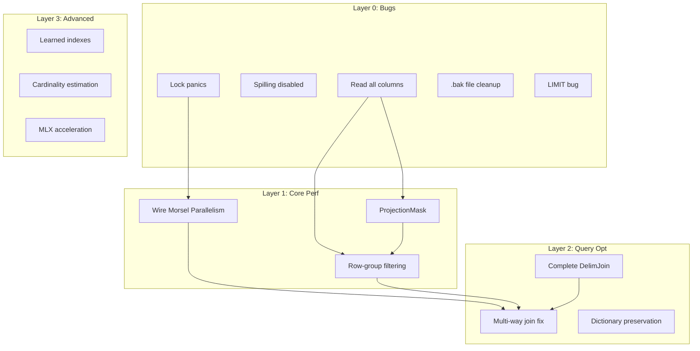

# Impact Analysis & Dependency Graph

**Created**: 2026-02-12
**Purpose**: Understand how improvements interact before making changes

---

## The Improvement Universe

### Layer 0: Bugs & Foundation (DO FIRST)

| ID | Issue | Impact | Blocks | Fix |
|----|-------|--------|--------|-----|
| B1 | Lock `.unwrap()` panics | Runtime crashes | All parallel work | Replace with `expect()` or error propagation |
| B2 | Spilling disabled | Can't handle >memory queries | SF10+ benchmarks | Debug and re-enable |
| B3 | Parquet reads ALL columns | Wasted I/O | Row-group filtering | Implement ProjectionMask |
| B4 | `.bak` file with Q21 code | Confusion, lost work | Q21 fix | Merge or delete |
| B5 | LIMIT bug (#11) | Wrong results | Benchmark validity | Investigate limit.rs |

**Lesson**: Fix bugs before optimizations. Optimizing buggy code amplifies the bugs.

---

## Dependency Graph (Mermaid)



---

## Interaction Matrix

| Change | P1: Morsel | P2: Row-group | P3: Projection | Q1: DelimJoin | Q2: Multi-join | Q3: Dictionary |
|--------|------------|---------------|----------------|---------------|----------------|----------------|
| **P1: Morsel** | — | ✅ Additive | ✅ Additive | ⚠️ Parallel | ✅ Additive | ⚠️ Parallel |
| **P2: Row-group** | ✅ Additive | — | ⚠️ Depends | ⚠️ Indep | ✅ Additive | ⚠️ Indep |
| **P3: Projection** | ✅ Additive | ⚠️ Needs first | — | ⚠️ Indep | ✅ Additive | ✅ Additive |
| **Q1: DelimJoin** | ⚠️ Parallel | ⚠️ Indep | ⚠️ Indep | — | ✅ Additive | ⚠️ Indep |
| **Q2: Multi-join** | ✅ Additive | ✅ Additive | ✅ Additive | ✅ Additive | — | ✅ Additive |
| **Q3: Dictionary** | ⚠️ Parallel | ⚠️ Indep | ✅ Additive | ⚠️ Indep | ✅ Additive | — |

**Legend**:
- ✅ **Additive**: Benefits multiply (do both!)
- ⚠️ **Parallel**: Need to coordinate threading model
- ⚠️ **Depends**: Must do dependency first
- ⚠️ **Indep**: No interaction, can do in any order

---

## Impact Chain Analysis

### Chain 1: The I/O Reduction Chain
```
B3 (ProjectionMask) → P2 (Row-group filtering) → Q2 (Multi-way joins)
```
**Why it chains**: ProjectionMask reduces columns read → Row-group filtering skips row groups → Less data flowing through joins → Multi-way joins faster

**ROI**: Each step compounds. If each gives 2x, chain gives 8x (2³).

### Chain 2: The Parallelism Chain
```
B1 (Fix lock panics) → P1 (Wire morsel) → Q2 (Multi-way joins)
```
**Why it chains**: Can't safely parallelize with panicking locks → Morsel gives 4-8x on scans → Joins benefit from parallel scan

**ROI**: Morsel alone gives 4-8x. Combined with fixed joins, can reach 10-20x.

### Chain 3: The Subquery Chain
```
B4 (Merge .bak code) → Q1 (Complete DelimJoin) → Q21 speedup
```
**Why it chains**: The .bak file has the MultiDelimJoin code → Completing it fixes Q21 → 2790x → 12x overall

**ROI**: Single biggest win. Q21 = 92% of total time.

---

## Independence Groups (Can Parallelize)

### Group A: I/O Layer (Independent)
- B3: ProjectionMask
- P2: Row-group filtering
- P3: Column projection

**Can be done by one person/stream without conflicts.**

### Group B: Execution Layer (Independent)
- B1: Fix lock panics
- P1: Wire morsel
- Q3: Dictionary preservation

**Can be done by another person/stream.**

### Group C: Query Layer (Independent)
- Q1: Complete DelimJoin
- Q2: Multi-way join fix
- B4: .bak cleanup

**Can be done by a third person/stream.**

---

## True ROI Calculation

Accounting for dependencies and interactions:

| Rank | Change | Raw ROI | Dependencies | True ROI |
|------|--------|---------|--------------|----------|
| 1 | **Q1: Complete DelimJoin** | 12x | B4 cleanup | **10x** (blocked by B4) |
| 2 | **P1: Wire Morsel** | 4-8x | B1 fix locks | **5x** (must fix B1 first) |
| 3 | **P2: Row-group filtering** | 2-5x | P3 ProjectionMask | **3x** (P3 first) |
| 4 | **P3: ProjectionMask** | 1.5-2x | None | **2x** (independent) |
| 5 | **B1: Fix lock panics** | Safety | None | **Required** |
| 6 | **Q2: Multi-way joins** | 2-5x | P1, P2, Q1 | **5x** (do after chain) |
| 7 | **Q3: Dictionary preservation** | 2-4x | None | **2x** (independent) |
| 8 | **B2: Enable spilling** | SF10+ | None | **Required for scale** |

---

## Recommended Execution Order

```
Phase 0: Foundation (1-2 days)
├── B1: Fix lock panics          [REQUIRED for P1]
├── B3: ProjectionMask           [REQUIRED for P2]
├── B4: Merge/delete .bak        [REQUIRED for Q1]
└── B5: Fix LIMIT bug            [REQUIRED for correctness]

Phase 1: I/O Optimization (2-3 days)
├── P3: Column projection        [Independent]
└── P2: Row-group filtering      [Depends on P3]

Phase 2: Execution Parallelism (3-5 days)
└── P1: Wire morsel parallelism  [Depends on B1]

Phase 3: Query Optimization (5-7 days)
├── Q1: Complete DelimJoin       [Depends on B4]
└── Q2: Multi-way join fix       [Depends on P1, P2, Q1]

Phase 4: Polish (2-3 days)
├── Q3: Dictionary preservation  [Independent]
└── B2: Enable spilling          [Independent]
```

---

## Verification Protocol

### Before Each Change
1. Run `cargo test` — baseline all passing
2. Run TPC-H SF=0.01 — record all 22 query times
3. Document expected change

### After Each Change
1. Run `cargo test` — must still pass
2. Run TPC-H SF=0.01 — compare against baseline
3. If regression: investigate or revert
4. Update this document with actual ROI

### Chain Verification
After completing a dependency chain:
1. Run TPC-H SF=0.1 — measure compound effect
2. Compare to expected compound ROI
3. Investigate if actual < 50% of expected

---

## Lessons Learned

### From This Analysis

1. **Dependencies matter** — Can't do P1 (morsel) safely without B1 (fix locks)
2. **Chains compound** — ProjectionMask → Row-group → Joins = multiplicative gains
3. **Independence enables parallelism** — Three groups can work in parallel
4. **Bugs block optimizations** — Fix B1 before P1, or parallelism will expose panics

### For Future Changes

When adding a new improvement, document:
- What it depends on
- What depends on it
- What it's additive with
- What it conflicts with

---

## Changelog

| Date | Change | Notes |
|------|--------|-------|
| 2026-02-12 | Initial analysis | Created dependency graph |
| | | |
