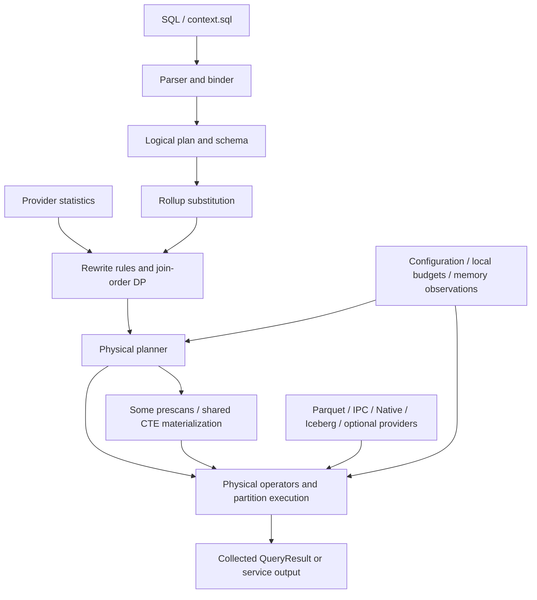

# Current architecture and verification map

The current parallel-controller candidate keeps canonical key owners stable
while choosing serial or scoped Rayon processing per actual batch. It avoids
parallel dispatch for one active owner or fewer than256 rows per active owner.
This is a provisional scheduling policy; spill, reservations and output ownership
are unchanged. [Tests and pending optimized validation](aggregate-batch-dispatch-2026-09-08.md).

The live grouped aggregate candidate now uses validated row selections and
canonical-key routing into at most four shared-pool spillable controllers.
Startup admission precedes source opening; each batch is retained until scoped
worker processing finishes. Complete disjoint groups concatenate after each
worker's partial-state merge. Global queries retain one controller. No dependency
change. [Validation, measured gain and remaining gates](parallel-aggregate-candidate-2026-09-08.md).

The disjoint-key ownership policy limits low-cardinality/skewed workloads:
canonical Q1's four actual groups route99.35% of rows to two owners, even with
16 configured threads. Frozen0f30c946 spends6.95s on native aggregate processing
versus0.035ms on output. The implemented experimental `QE_AGG_OWNERSHIP=partial` distributes rows across
workers and requires cross-worker reduction before HAVING/output. Resident partials
use bounded parallel reduction; spilled inputs retain the admitted serial fallback.
Default ownership remains disjoint because the measured tradeoff varies with
thread count. See [implemented partial ownership](balanced-aggregate-ownership-2026-09-09.md)
and [parallel reduction](parallel-aggregate-reduction-2026-09-09.md).
[Reproduction and required memory/merge contracts](q1-aggregate-owner-skew-2026-09-09.md).

Shared-table cache preparation now returns a Result and propagates provider scan
errors before publishing newly collected cache entries. An error no longer becomes
a cache miss followed by implicit replay. Eager provider allocation and other
speculative execution boundaries remain separate work.
[Reproducer and validation](shared-prescan-error-propagation-2026-09-08.md).

Completed UTF8 group keys now feed admitted Arrow output as borrowed canonical
string slices, removing an intermediate owned scalar per key. Reserved scratch,
payload/offset/validity buffers and retained type/batch owners preserve the output
admission contract. Nested/selected paths and chunk policy are unchanged.
[889 library and31 integration passes; measured Q10 improvement and suite limits](borrowed-key-output-2026-09-07.md).

Outer-join predicate pushdown now separates ON from incoming WHERE predicates.
Eligible total right-only ON atoms move below LEFT joins, and left-only atoms
below RIGHT joins. Qualified ownership and explicit type/expression eligibility
guard movement; other residuals remain at the join. No dependency or physical
operator contract changed. [Validation status](outer-on-predicate-pushdown-2026-09-07.md).

The live partial-state Arrow boundary now separates runtime dictionary encoding
from bound logical types. Key, fixed-state and selected-state ingestion borrow
dictionary values with checked codes and SQL NULL semantics; changing codebooks
do not change group identity. This adds no decoded-array materialization or
dependency. [Validation and remaining release failures](live-dictionary-boundary-2026-09-07.md).

The production supported SpillableHashAggregateExec uses
`morsel_agg/live_spill.rs`: bound state/output schemas, up to four disjoint
ingestion/spill controllers, an owned input frontier, single evaluation, admitted
output collection and no input replay on budget pressure. Supported HAVING binds
before input and filters complete merged groups through the shared admitted batch
filter. Unsupported capabilities decline before consumption; empty scalar routing
retains its ordinary path. Frozen fe3cc8fe repairs the reproduced input retention
refusal, but high-cardinality spill remains slow: that frozen binary uses File directly for row-framed I/O and finalizes controllers
serially. Current source adds admitted I/O buffering as described below. See the
[current HAVING validation and measured spill cost](admitted-having-output-2026-09-09.md);
the [original integration gate](live-spill-integration-2026-09-07.md) is historical.

`admitted_output.rs` now builds Arrow ranges from complete groups with reserved
payload, scratch and type/batch metadata owners. Buffers and an Array delegation
wrapper retain owners through normal output lifetimes. Actual all-valid output
now omits validity allocation; NULL-bearing output retains admitted bitmaps.
Payload owners survive slices/ArrayData extraction including empty primitive
buffers; see [optional validity](optional-output-validity-2026-09-09.md). Unsigned SUM in this new
state path uses exact scale-zero i128 partials with final UInt64 overflow checking.
The controller synthesizes empty global COUNT/AVG states. Live operator routing
and admitted result collections remain open.
[109 focused passes and scope](admitted-group-output-2026-09-07.md).

`ingestion_controller.rs` now composes retained evaluated input, transactional
partial flushing, resident-capacity release, bounded compaction and scheduled
final merge. It retains a prepared writer across batches and refuses a row that
cannot fit empty state. A256KiB component test covers real pressure with exact
decimal/COUNT/AVG states. Live workers and admitted Arrow output remain open.
[104 focused passes and scope](ingestion-controller-2026-09-07.md).

`GroupRows::process_evaluated_from` now applies retained evaluated arrays through
complete row transactions, returning the first uncommitted row on denial.
Variable selected winners use admitted encoding scratch and final owners; numeric
candidates stay inline. Key/scalar encoding distinguishes canonical grouping from
retained float bits. Live controller/output integration remains open.
[101 focused passes and scope](arrow-state-input-2026-09-07.md).

Current prepared-key chunks use `key_rows/bound_arrays.rs` to bind primitive
Arrow downcasts and validity buffers once against the exact retained batch.
Binding metadata is reserved within the existing optional preparation child pool;
reservation refusal releases preparation before ordinary routing. Variable and
dictionary keys retain checked canonical traversal. Hashing, full equality, row
identity and spill retry are unchanged. Frozen0f30c946 passes1,036 library tests and36 feature-enabled integrations;
seven pre-existing full spill failures remain. Completed protected/provider/residency
measurements remain incomplete for overall acceptance; see [key-binding audit](aggregate-key-binding-audit-2026-09-09.md).

Canonical key scratch now accepts borrowed evaluated Arrow arrays through
`key_rows/arrow_input.rs`. Full-row validation precedes destination admission;
strings/lists do not become owned intermediate scalars. Type identity and logical
NULL semantics are explicit. Live routing remains open.
[98 focused passes and scope](arrow-key-input-2026-09-07.md).

Run accumulation now offers transactional compaction in `spill_files.rs`:
admitted shared file-owner metadata retains originals while the scheduler writes
one completed partial run; publication reuses a reserved slot. Bounded preparation
compacts before the next flush would exceed the configured count. Live ingestion
and output routing remain open. [111 focused passes and limits](run-compaction-2026-09-07.md).

Completed-run scheduling now lives in `physical/morsel_agg/partition_scheduler.rs`:
admitted tasks, merge attempts, global split proofs and smaller-child-first
processing. `RunMerge` preserves duplicate updates at an explicit group working
limit; real query reservations remain independent. Complete leaf groups reach a
borrowed callback whose retained output must be admitted by its consumer.
A256KiB/2048-group COUNT storage test forces real admission splitting and passes.
Live ingestion/output integration is open. [109 focused passes and limits](partition-scheduler-2026-09-07.md).

Global partition planning now scans all source runs for one canonical-key split,
proves combined child counts and copies into two completed children. A reusable
RunReader slot enforces completed-source EOF before switching runs under its
existing query reservation. Source collections remain borrowed/admitted by the
caller. The task scheduler/live route remain open.
[106 focused passes and limits](partition-plan-2026-09-07.md).

Checked split planning: `SplitPlan` scans a complete run under admission, proves
nonempty child counts and binds the choice to that source. Production repartition
requires the plan and verifies actual counts. Equal-key/empty runs return no split
only after full integrity/EOF checks. Multi-run bounded scheduling remains open.
[104 focused passes and limits](split-progress-2026-09-07.md).

Two-way spill repartition: `physical/morsel_agg/repartition.rs` routes verified
row payloads by canonical key bits with prefix-safe end markers. It uses one
admitted frame/two writers, preserves source ownership on failure and finishes
both child runs before returning them. Copying preserves partial-state bytes;
no selected-value decode or finalization occurs. Split selection/progress and
bounded scheduling remain open. [102 focused passes and limits](repartition-2026-09-07.md).

Spill parent ownership: `RunDirectory` owns an admitted, uniquely created private
directory. Production run creation/flush requires this owner, and every file
retains it through active readers. Last-owner cleanup removes only the empty
directory, preserving foreign entries. The configured scratch root stays external.
Bounded partition scheduling/live integration remain open.
[99 focused passes and limits](spill-directory-2026-09-07.md).

Resumable partial-run merge: `physical/morsel_agg/run_merge.rs` holds a verified
frame across decoding denial or a staged row across destination denial. It merges
exactly one partial per successful step, verifies EOF and poisons non-memory
errors. Scratch payload validity is explicit. Bounded partition scheduling and
live worker integration remain open; no routing change.
[97 focused passes and limits](run-merge-2026-09-07.md).

Prepared flush publication: `RunCollection` owns admitted run metadata, and
`PreparedFlush` reserves its slot/file owner before resident state fills the pool.
All rows are written and the completed run inserted before source groups clear.
Failures preserve source state; consuming iteration retains its allocation lease.
Bounded partition merge and worker integration remain open; no live routing change.
[94 focused passes and limits](run-collection-2026-09-07.md).

Spill file component: `physical/morsel_agg/spill_files.rs` admits path/owner and
reader metadata, creates unique private files and publishes a completed-run
capability only after successful writing/length verification. Readers hold file
ownership, use independent handles and validate frame counts/EOF. Last-owner
cleanup removes only the created file. Parent directories/run collections and
bounded worker integration remain open. No live routing changed.
[92 focused passes and limits](spill-files-2026-09-07.md).

Spill frame component: `physical/morsel_agg/spill_frames.rs` uses per-binding
layout UUIDs and per-run UUIDs, ordinal/length headers and CRC32 checks. Payload
scratch is admitted from the bound layout pool. Budget denial rewinds the reader;
other IO/validation failures poison its cursor. Writers retain source rows after
failure. Complete-file identity/count ownership and publication remain open.
No live routing changed. [88 focused passes and limits](spill-frames-2026-09-07.md).

Grouped restoration now composes key/fixed/selected codecs under an unpublished
row transaction. Complete payload validation precedes admission; error/drop
releases pending selected owners and rolls back key/state rows. Commit alone
publishes the hash index. Repeated run keys restore into staging and merge partial
states. File identity/publication and bounded worker integration remain open.
[85 focused passes and limits](row-restoration-2026-09-07.md).

Selected-state decoding: `execution/reserved_scalar/decode.rs` validates typed
wire values, admits retained payload/type memory, then constructs owned scalars.
`BoundSelection::decode_payload` returns pending owned strings/lists/timestamps
or allocation-free numeric/NULL payloads. Whole-row restoration is now composed above; file/controller
integration remains open. [83 focused passes and limits](scalar-state-read-2026-09-07.md).

Partial-row serialization now writes a versioned key/state payload directly from
borrowed `GroupRows`/`StateRows`. Fixed codecs preserve partial algebra, while
`scalar_state_codec.rs` preserves selected values including exact floating bits.
Whole-row prevalidation precedes output; IO errors preserve source ownership.
File publication and validated selected-state restoration remain open. This is
outside live routing. [77 focused passes and limits](state-row-write-2026-09-07.md).

Prepared grouped input uses up to four scoped contiguous chunks under one child
pool; original row indices map to their exact chunk/local position. Small batches
remain serial. Scoped preparation finishes before success, failure or fallback;
canonical routing and worker spill cursors remain unchanged. Frozen e6a60347
improves canonical Q10 by14.29% versus serial preparation; the prespecified Q2
follow-up bounds its95% slowdown below10%. Q12/Q13 and broader provider/resource
gates remain open. See parallel-key-preparation-2026-09-08.md.

Prepared grouped input: `physical/morsel_agg/prepared_keys.rs` optionally owns
canonical bytes/offsets and cached hashes for an exact borrowed evaluated batch
and combined layout. Routing and selected-row state updates share these keys;
full byte/layout equality remains authoritative. Preparation has a child cap of
one eighth of currently available query memory. Admission refusal drops temporary
storage and selects ordinary routing before state mutation; other errors propagate.
The owner survives scoped worker completion and spill cursors. This changes
private aggregation input ownership, not SQL semantics or provider capability.
See `docs/prepared-aggregate-keys-2026-09-08.md` for current validation limits.

Canonical grouped storage: `physical/morsel_agg/key_rows.rs` owns flat admitted
canonical keys. Its import/framed-read APIs validate complete encodings before
publishing a key; framed reads admit scratch before consuming payload bytes.
Malformed reads invalidate the preceding view. File version/layout identity
remains the enclosing reader’s responsibility. See
[74 focused passes and read limits](key-read-validation-2026-09-07.md).
`group_rows.rs` adds a full-key hash index with old-plus-new
allocation admission. `PreparedGroup` publishes an index entry only after the
complete row commits; error/drop removes unpublished keys and state rows.
Indexed merge preserves partial aggregate algebra and selected payload leases.
These components remain outside query ingestion/spilling. See
[70 focused passes and limits](indexed-group-storage-2026-09-07.md).

Partial aggregate row component: `physical/morsel_agg/state_rows.rs` binds slots
and fixed finalization functions, stores groups in flat fixed/selected arrays,
and prepares updates/merges in reusable admitted scratch before atomic commit.
Selected output stays borrowed. New checked arithmetic applies only to this
unconnected row path; live routing remains unchanged. See
[59 focused passes and remaining work](aggregate-state-rows-2026-09-07.md).

Bound selected-state component: `physical/morsel_agg/selected_state.rs` uses
`ReservedDataType` for shared layout metadata and admitted scalar owners for
variable payloads. Borrowed preparation tokens support rollback before commit;
same-layout merge shares payload leases. It is not connected to aggregate
ingestion/routing. See [49 focused passes and remaining work](selected-state-slots-2026-09-07.md).

Selected-state ownership prerequisite: `execution::reserved_scalar::ReservedScalar`
owns an admitted scalar payload and its lease through movement/shared ownership.
Fallible string/list copies follow complete admission; metadata accounting is
conservative with checked bounded traversal. It is not connected to aggregate
slots or routing. See [tests and limitations](selected-scalar-ownership-2026-09-07.md).

2026-09-07 extrema contract repair: typed floating MIN/MAX ingestion and
vectorized/legacy hash extrema update and merge use the existing SQL comparator,
matching scalar state merge. Primitive IEEE comparison previously produced
NaN for MIN(NaN, -7) in ordinary and both fused modes. No storage, dependency
or routing change. See [the 841-pass validation and limits](float-extrema-ordering-2026-09-07.md).

2026-09-06 key contract update: vectorized joins retain ordinary NULL nonmatches;
vectorized grouping uses `compare_group_row` with NULL-safe key equivalence.
`numeric::sql_float_key` canonicalizes signed zeros and NaN payloads for vectorized
hashes and morsel dictionaries. Compiled join residuals share SQL float comparison.
Float predicate results use packed Boolean values and separate validity handling.
See [tests and limits](float-grouping-domain-findings-2026-09-06.md).


SQL floating comparison now has a shared contract in `planner/numeric.rs`:
signed zeros compare equal; NaNs are equal and ordered above non-NaNs. Scalar,
broadcast and array interpretation, constant folding and compiled F64 predicates
use it. The key-equivalence update above covers vectorized/morsel keys and
compiled join residuals; physical sort and other key encodings still require auditing. See [validation](float-comparison-domain-findings-2026-09-06.md).


Current optimizer contract: literal CAST normalization delegates to the execution
cast kernel and replaces only exactly representable successful non-NULL
scalar values. Planning defers cast failures and integer arithmetic overflow.
Traversal covers scan filters and sort/IN/BETWEEN expressions; provider pushdown
policy is unchanged. See [validation](constant-cast-normalization-2026-09-06.md).


2026-09-06 contract update: `physical/operators/substring.rs` centralizes string
slicing, NULL propagation and signed character bounds. VALUES binding now infers
column types across all rows; physical evaluation strictly casts each cell before
concatenation. These contracts have focused and broader regression coverage;
optimized release oracle validation passes; the five-query canonical SF10 release screen passes. No dependency changes.

Latest subquery planning update (2026-09-06): `SubqueryExecutor::plan_subquery`
applies the existing projection-dependency rule independently for scalar, IN and
EXISTS plans before provider scanning. Outer-plan pruning does not traverse these
expression scopes. Correlated IN now contributes its outer-column dependencies
to pruning, matching EXISTS/scalars. Cache identity and memory admission remain
unchanged. `QE_INPUT_QUEUE_TRACE=1` adds opt-in queue/drain/reduction diagnostics;
it is not resource certification. [Evidence and current validation](ipc-scalar-subquery-attribution-2026-09-06.md).

**Base review:** 2026-09-05 against `88849c4`; subsequent implementation updates describe the working tree. Use the linked frozen-source manifests to associate measurements with exact code, since HEAD alone does not identify these uncommitted changes. See the [audit and path forward](project-audit-2026-09-05.md) for prioritized findings, benchmark caveats and references.

**Current implementation update:** the [systemic correctness changes](systemic-correctness-fixes-2026-09-05.md)
add a shared arithmetic/CASE type contract, a full-width Decimal128 scalar and
checked decimal aggregate states. Alias lists now produce rename projections;
subquery materialization drives all partitions and validates scalar cardinality
across batches. The benchmark package and initial canonical failures remain
historical evidence; consult the linked fix report for current verification.
Dependencies and the overall provider/execution architecture are unchanged.

## 1. System boundary

This is a Rust SQL engine with local columnar execution, several table providers, native mutable storage, and HTTP/Flight distributed service paths. The intended Iceberg use case has expanded into SQL compatibility, Lance/vector search, GPU aggregation, native mutations/rollups, Pulsar integration and a query UI.

The default build uses Rust 2021 with declared MSRV 1.93.0, sqlparser 0.62, Arrow/Parquet/Flight 58, Tokio, Rayon, hashbrown and mimalloc. Lance 10, GPU support and Pulsar are optional Cargo features. `Cargo.toml` and `Cargo.lock` are the dependency authority; historical version notes are not.

The top-level public entry point is `ExecutionContext`. It owns the catalog/providers, optimizer, execution configuration and memory pool. `sql(&self, sql)` returns a collected `QueryResult` with schema, batches, row count and metrics. Separate methods implement native DDL/mutation and rollup registration/refresh.

## 2. Query flow

`src/execution/context.rs::sql` is the main path to read first:

1. Parse SQL and reject statements that require a dedicated mutation API.
2. Bind against catalog schemas into a logical plan.
3. Substitute eligible, fresh materialized rollups.
4. Collect provider statistics and optimize the logical plan.
5. Construct a configured physical planner and register providers/subquery support.
6. Lower the plan; this currently includes some prescans and CTE execution.
7. Execute all declared root partitions and collect their batches.
8. Finalize output representation and return metrics/results.



The diagram deliberately distinguishes the declared stream interface from eager implementation boundaries. Moving data execution out of physical planning is a proposed change, not current behavior.

Current frozen Q9 attribution confirms that declared partitions do not imply
parallel input polling: computed projections decline the prepared capability,
and the aggregate frontier falls back to one slot. Copied-output bounds require
pool-independent future pulls; query-pool expression allocation needs a
transitive admitted-buffer contract instead. The same residency screen records
Q15 planning657ms versus execution5ms because shared CTE work runs before the
final plan is returned. These are measured limitations of existing contracts,
not new modules or changed routing. See [Q9 attribution](output-quantum-q09-attribution-2026-09-09.md)
and [residency evidence](output-quantum-residency-2026-09-09.md).

The admitted pipeline adds `project/admitted.rs`, a closed typed program
whose temporary and output construction is charged to the query pool. It composes
admitted child partitions without expanding copied-output bounds. `filter/temporal.rs`
provides admitted Date32 EXTRACT; `hash_join/outer_probe.rs` shares its bounded probe
cursor with eligible inner joins while omitting outer match state. Unsupported
capabilities decline before child preparation; runtime failures terminate without
replay. See [implementation and gates](admitted-computed-pipeline-2026-09-09.md).

The planner-facing `SpillableHashJoinExec` now forwards admitted preparation for
inner as well as outer joins only when its cached build decision is InMemory.
Spilled decisions retain the ordinary fallback. Direct HashJoin capability tests
are supplemented by a wrapper-level four-partition ownership regression.

Fixed-width raw scans can now offer the existing admitted Parquet decoder as
a separate prepared capability. The copied-output certificate remains valid for
ordinary execution. Preparation-only memory refusal may decline to that certified
route before consuming pages; selected-stream errors remain terminal. No legacy
buffer is relabeled as admitted. See [fixed-width scan contract](fixed-width-admitted-scan-2026-09-09.md).

Native streaming now holds a `NativeSegmentReader` over incremental IPC
`RowGroupReader`: each pull decodes and deletion-filters one batch, with an immutable
deletion snapshot and checked row cursor. The collecting APIs consume the same
reader/selection logic. Footer/dictionary metadata stays reader-owned; detached
arrays retain their mmap owner. Late errors are terminal, and blocking decode jobs
produce at most one output. This removes whole-segment survivor queues but does
not admit metadata, dictionaries or selected outputs to the query pool. A native
admitted factory still requires reserved selection and ownership.
See [incremental native contract](native-incremental-ipc-2026-09-10.md).

In-memory join build materialization now preserves the producer’s declared
schema instead of substituting the first physical batch schema. Dictionary
codebooks remain batch-local representations; they cannot change the delegate’s
logical output domain or field metadata. The spill partition scheduler also
retains the original typed memory refusal when a single-key partition cannot
be split. See [schema and refusal contracts](build-schema-admission-2026-09-09.md).

## 3. Source map

| Area | Files | Responsibility and actual boundary |
|---|---|---|
| Public API and CLI | [lib.rs](../src/lib.rs), [main.rs](../src/main.rs), [cli](../src/cli) | Exports, commands, REPL, display/CSV, feature selection; main establishes process cap |
| Parsing | [parser](../src/parser) | sqlparser wrapping and statement handling |
| Binding | [binder.rs](../src/planner/binder.rs) | Name/type resolution, SQL lowering, CTEs, subqueries, windows and grouping forms |
| Logical model | [logical_plan.rs](../src/planner/logical_plan.rs), [logical_expr.rs](../src/planner/logical_expr.rs), [schema.rs](../src/planner/schema.rs) | Plans, expressions, cached schemas, column identity |
| Numeric contract | [numeric.rs](../src/planner/numeric.rs), [decimal.rs](../src/planner/decimal.rs) | Shared arithmetic/CASE types and full-width decimal scalar value/scale semantics |
| Optimization | [optimizer/mod.rs](../src/optimizer/mod.rs), [rules](../src/optimizer/rules) | Ordered rule pipeline and statistics-aware join enumeration |
| Physical planning | [physical/planner.rs](../src/physical/planner.rs) | Provider routing, specialized operators, CTE caches, runtime-filter registration, spill coverage/admission |
| Operator interface | [physical/plan.rs](../src/physical/plan.rs) | `PhysicalOperator`, `RecordBatchStream`, partition guard and plan display |
| Expressions | [filter.rs](../src/physical/operators/filter.rs), [project.rs](../src/physical/operators/project.rs), [compiled_expr.rs](../src/physical/compiled_expr.rs) | General Arrow expression evaluation and narrow fused predicate program |
| Hash join | [hash_join.rs](../src/physical/operators/hash_join.rs), [vectorized_hash.rs](../src/physical/operators/vectorized_hash.rs) | General/specialized build/probe, direct addressing, dictionaries, RowStore, runtime filters |
| Aggregation | [hash_agg.rs](../src/physical/operators/hash_agg.rs), [operators/morsel_agg.rs](../src/physical/operators/morsel_agg.rs), [physical/morsel_agg.rs](../src/physical/morsel_agg.rs), [vectorized_agg.rs](../src/physical/vectorized_agg.rs) | General states, parallel scan aggregates, dense/raw paths, merge/finalize; multiple implementations |
| Scan scheduling | [morsel.rs](../src/physical/morsel.rs), [streaming_parquet_scan.rs](../src/physical/operators/streaming_parquet_scan.rs), [native_scan.rs](../src/physical/operators/native_scan.rs) | Work sources, row-group partitions and bounded native segments |
| Spill execution | [spillable.rs](../src/physical/operators/spillable.rs) | Spillable joins/aggregates, external sorting, partitioned readback, channels, accounting estimates and chaos hooks |
| Other operators | [operators](../src/physical/operators) | Window, sort/TopN, limit, union, delim joins, fallback subqueries, vector search |
| Query resources | [execution/memory.rs](../src/execution/memory.rs), [topology.rs](../src/execution/topology.rs), [alloc_profile.rs](../src/execution/alloc_profile.rs) | Configuration, pool/reservation API, observations, process cap, THP/NUMA and allocation diagnostics |
| Storage | [storage](../src/storage) | Providers, metadata/pruning, IPC cache, native manifests/mutations/rollups, optional readers |
| Distribution | [distributed](../src/distributed) | Membership, splits/shards, fragment planning, coordinator/gather, HTTP/Flight, query log/UI |
| Catalog integration | [metastore](../src/metastore) | Older REST client and Gravitino integration |
| Fixtures | [tpch](../src/tpch) | Custom deterministic TPC-H-derived generator, schemas and query set |

Some names are historical. In particular, the real current Iceberg provider is `src/storage/iceberg.rs`; do not infer the production path solely from the older physical operator file. Similarly, `physical/morsel_agg.rs` and `physical/operators/morsel_agg.rs` are different layers, not duplicate filenames to merge blindly.

## 4. Logical optimizer

The configured pipeline includes constant folding, OR-derived predicates, predicate pushdown, dependent-join flattening and subquery decorrelation, semi-join pushdown, join reordering, HAVING common-subexpression sharing, group-key reduction, eager aggregation, packed group/join keys, projection pushdown and vector-search recognition.

Join order is not merely greedy: `JoinReorder` uses bounded subset dynamic programming with provider row counts and column statistics. The active cost objective is estimated intermediate row counts. Missing/degenerate NDV has warnings and fallbacks. The separate `CostEstimator` module is not the live optimizer decision path.

The optimizer iterates complete rule rounds up to a limit, detects convergence through structural LogicalPlan equality, and runs packed join keys exactly once after the main loop. OR-predicate derivation uses structural Column/Expr identity and explicit first-occurrence order. Logical-to-Arrow schema qualification still has separate lossy name boundaries; see the [identity investigation](or-column-identity-2026-09-07.md).

Important contracts to preserve or strengthen:

- A semantics-preserving rewrite cannot rely on sampled or estimated uniqueness.
- Column bindings, schemas and aliases must remain valid after every rewrite.
- Scalar/subquery/NULL semantics must survive decorrelation and key packing.
- Physical-choice statistics should carry provenance, confidence and snapshot validity.
- A general logical/physical property validator is needed; current checks do not form a complete validator.

The estimate-to-uniqueness rewrites now require structural ordinal key proofs (`optimizer/properties.rs`); scan NDV is never a proof. Group-key reduction preserves keys from aggregation/DISTINCT and identity projections, while unproven join elimination and deferred rejoin are disabled. Shared subquery materialization drives all declared partitions; other collection boundaries still require resource and partition review.

## 5. Physical execution and scheduling

`PhysicalOperator` exposes schema, children, `execute(partition)`, `output_partitions` and a display name. `RecordBatchStream` is a boxed asynchronous stream of fallible Arrow RecordBatches. `check_partition` detects execution outside an operator's declared range.

This interface does not declare required input distribution, output ordering, stable execution properties, cancellation tokens or a common rewrite/child-replacement mechanism. Every parent currently needs to understand how to drive its inputs.

Execution paths differ:

| Path | Behavior |
|---|---|
| Eligible Parquet scan/aggregate | Specialized morsel source and parallel aggregate workers, sometimes dense direct-address states |
| Ordinary filter/project | Batch evaluation with Arrow arrays and compaction |
| In-memory hash join | Build materialization, specialized tables; current probe/result paths also collect vectors |
| Spilled join | Streamed build crossing, partitioned state, bounded probe/output and chunked/K-way readback |
| Aggregate/sort spill | Running input accounting and streamed spill/merge paths |
| Provider fallback | Often eager `scan_with_filter` into batches |
| Root result | All output partitions are collected into memory |

Rayon, Tokio, blocking tasks and a dedicated subquery runtime coexist. They must be measured as one total CPU/memory budget; counting async futures is not counting CPU workers.

Re-execution matters: cached build/CTE/filter state needs correct query lifetime. Cancellation must clean temporary files and stop work across source, probe, merge and output. Existing path-specific handling is not a uniform lifecycle contract.

## 6. Storage and capabilities

`TableProvider` in [scan.rs](../src/physical/operators/scan.rs) exposes schema, eager scans, optional filter-aware scans and statistics, plus capabilities for file exposure, identity, vector search and distributed splits. Unsupported optional behavior should signal fallback or an explicit error, not silently change answers.

| Provider/layer | Implementation |
|---|---|
| Memory | Arrow batches and row-count statistics; no general exact column constraints |
| Parquet | Metadata-driven projection/pruning, dictionary paths, multiple scan modes |
| IPC cache | Optional/Auto decoded `.qeipc` sidecars; mmap reads alter the storage premise of a benchmark |
| Native | Manifests and Arrow IPC segments, snapshot identity, per-segment statistics, tombstones and mutation publication |
| Native mutation | Separate write/delete/update modules; SQL entry points and admission checks |
| Native rollups | Matching/substitution and refresh-on-write; must report when a query is answered by a rollup |
| Iceberg | Metadata/snapshots and Avro manifests feeding underlying data scans; verify supported delete/partition semantics per workload |
| Lance | Optional Lance 10 read/write/version/vector-index integration |
| Pulsar | Optional REST/WebSocket bounded topic snapshots |
| GPU | Optional aggregate kernels and resident-column cache, with capability/semantic restrictions |

Native/IPC file-backed mmap avoids some copies, but mapped pages, decoded arrays, dictionaries and operator state still have resource consequences. “Zero-copy” does not imply zero memory traffic or universally free residency.

Provider-neutral lazy scan tasks are a proposed direction. They must preserve snapshot identity, exact filter semantics, pushdown-versus-residual distinction, statistics provenance and capability fallback.

## 7. Resource model

`ExecutionConfig::default` sets a 1 GiB execution budget, 0.8 spill threshold, 8,192-row batch size and enabled morsel aggregation. The default temporary path uses the platform temp directory; local agent commands must set `TMPDIR` to repository scratch so generated spill/test files stay within project rules.

Three layers exist:

1. **Operational build/test containment:** `scripts/claude-safe-build.sh` uses a transient user systemd scope, normally MemoryMax 80G and eight Cargo jobs. Tune the cap to the host; multiple independently capped jobs can still exhaust aggregate host memory.
2. **Engine process defense:** `main` invokes `enforce_process_memory_cap`; on Linux, RLIMIT_DATA defaults to 64G and is configurable with `QE_MEM_CAP`. Allocation failure can abort; this is not query recovery. THP is disabled deliberately by default.
3. **Execution policy/accounting:** pool/reservation API plus per-operator thresholds and observations. Current hot operators do not consistently reserve through the shared pool; `observe` records a maximum of local estimates.

Do not report pool observations as precise process RSS or sum-of-active-operator memory. Each SQL invocation now has a separate child pool and stable query ID; reserved and locally observed peaks are reported separately. Owned reservations enforce ancestors atomically, but most operators have not yet migrated from observations to reservations.

The audited gaps include morsel aggregate states, in-memory join amplification, overlapping operator budgets, decoded gather admission, and collected final results. They coexist with useful, recently hardened spill implementations.

## 8. Distributed/service flow

`serve` exposes health/readiness/cluster/SQL plus query-log/UI endpoints; Flight provides a standard client-facing Arrow RPC path. Internal fragments use HTTP and Arrow IPC.

Membership and canonical split enumeration feed deterministic assignment. Supported partial/final plans include count/sum/min/max/avg, grouping and related exact shapes, TopN, and eligible joins against replicated tables. AVG transports sum/count and divides during finalization.

General fallback gathers selected base columns from workers and runs the original SQL on the initiator. This is not a partitioned distributed join. The coordinator, network buffers and final result remain central resource concerns.

Tests cover real processes and multiple SQL/transport paths, but same-host process success is not multi-host performance or failure-recovery certification. No general shuffle/exchange engine is implemented at this baseline.

## 9. Verification architecture

| Layer | Entry points | What a passing run establishes |
|---|---|---|
| Unit tests | Inline `#[cfg(test)]` modules | Properties of a specific component and its fixture |
| SQL integration | [sql_comprehensive.rs](../tests/sql_comprehensive.rs), other `tests/*.rs` | Cross-layer semantics for chosen shapes |
| Independent SQL fixtures | [duckdb_validated.rs](../tests/duckdb_validated.rs), `tests/expected_results` | Agreement under current CSV comparator, subject to its type/tolerance limitations |
| TPC-H-derived smoke | [tpch_queries.rs](../tests/tpch_queries.rs) | Query shapes execute; not full correctness by itself |
| Exact numeric regressions | [systemic_numeric_tests.rs](../tests/systemic_numeric_tests.rs) | Independent exact coefficients/scales, decimal overflow, alias and subquery boundaries, forced spill |
| Spill/metamorphic | [spill_tests.rs](../tests/spill_tests.rs), chaos hooks/harnesses | Alternate paths agree and spill is observed; shared bugs remain possible |
| Real cap tests | [oom_cap_harness.sh](../scripts/oom_cap_harness.sh), [example](../examples/oom_cap_harness.rs) | Completion/refusal/kill outcomes for actual selected scenarios and caps |
| Mutation/crash | `tests/native_*` and `examples/native_*` | Snapshot, publication, mutation and selected fault behavior |
| Distributed/Flight | [distributed_cluster.rs](../tests/distributed_cluster.rs), [flight_tests.rs](../tests/flight_tests.rs) | Protocol, membership, fragment and result checks for tested deployments |
| Optional features | Lance/GPU/Pulsar suites and scripts | Only exercised capabilities; missing fixture/device early returns need explicit skip reporting |
| Benchmark | CLI, `scripts/*bench*`, [benches/tpch.rs](../benches/tpch.rs) | Current drivers require fail-closed/status fixes before use as acceptance gates |
| CI | [.github/workflows/ci.yml](../.github/workflows/ci.yml) | Hosted build/test/style configuration; not local cgroup or performance certification |

Do not copy historical test totals into current status. The audit did not execute these suites. Record command, commit, features, environment, actual skips and output when a new run is performed.

Recommended changes are typed independent oracles, nonempty/skew/adversarial fixtures, path assertions, seeded SQL/plan generation, proper failure statuses, pinned environments, and periodic reserved-host performance/cap jobs. The [main audit](project-audit-2026-09-05.md) provides the matrix and delivery gates.

## 10. Safe local development

Use the existing wrapper, despite its historical name:

```bash
mkdir -p .scratch
# Generate the required small fixtures on a clean checkout
TMPDIR="$PWD/.scratch" scripts/claude-safe-build.sh cargo run --locked -- generate-parquet --sf 0.001 --output data/tpch-1mb
TMPDIR="$PWD/.scratch" scripts/claude-safe-build.sh cargo run --locked -- generate-parquet --sf 0.01 --output data/tpch-10mb
TMPDIR="$PWD/.scratch" scripts/claude-safe-build.sh cargo test --locked --test duckdb_validated
TMPDIR="$PWD/.scratch" scripts/claude-safe-build.sh cargo test --locked --test spill_tests
TMPDIR="$PWD/.scratch" scripts/claude-safe-build.sh cargo build --locked --release
cargo fmt --all -- --check
```

These are commands to run when needed, not checks performed by this audit. Data-dependent tests require their generated fixtures first. Keep generation, benchmark drivers, compiled engine examples, check/clippy and feature builds under the same resource containment. Never bypass containment because a wrapper or user systemd session is unavailable; resolve the environment first.

Before every commit, run the mandatory format check and fix any formatting errors. For a documentation-only change, verify references and `git diff --check`; an engine rebuild is unnecessary. Hosted CI requires its own explicit safe runner/container strategy rather than assuming this desktop user scope exists.

## Benchmark-only GPU entry point (2026-09-05)

`examples/sf10_gpu_serve.rs` uses the public production HTTP/Arrow server and
normal Parquet providers, with explicit GPU opt-in in its TableLoader. It requires
successful device initialization when GPU is requested, preserves the allocator,
memory cap, THP and topology setup, and supports a same-binary `QE_GPU=0` control.
Ordinary CLI `serve` continues to disable GPU. This is benchmark infrastructure;
no production operator or dependency changed.

`scripts/sf10_baseline.py` now covers the six measured engine modes plus that CPU
control. DuckDB Iceberg/Lance extensions run in a killable spawned worker and
record internal query time before IPC transfer. GPU evidence comes from actual
request-scoped device traces, not final-plan names: Q15's CTE materialization
hides an unsupported GPU grouping attempt that falls back to CPU. See the
[full baseline](benchmark-baseline-sf10-2026-09-05.md) for the preserved 1,540
samples, independent typed oracle checks, residency preparation and limitations.

## 2026-09-06 contract hardening

`Expr::Cast` now includes `CastMode::{Strict, Try}` through binding, rewriting, display and native expression identity. Failed strict/implicit conversions error; TRY_CAST nulls invalid values. `planner::numeric` selects exact common integer domains, using Decimal128(20,0) for signed/UInt64 mixtures. CASE evaluates only selected rows and supports its simple operand. IN/NOT IN use three-valued semantics and strict typed coercion; unsafe nullable anti-join decorrelation is disabled. Nested grandparent correlation remains an explicit unsupported boundary.

`MemoryReservation` owns its accounting domain and uses fallible growth. Process/context/query pools form a hierarchy; query metrics distinguish reservations from local estimates. Returned Arrow ownership and shared operator allocation admission remain unfinished. See [current contract evidence](systemic-contracts-2026-09-06.md).

Dense morsel state now owns reservations for its presence bitmap, fixed-width atomic
accumulators and vector headers, acquired before allocation and retained until buffer
destruction. Denial returns a named error before scanning. Perfect/hash aggregation,
provider input and result copies remain outside this ownership boundary.

The experimental public `DelimJoinExec` now refuses execution before child or index
work; its SQL flattening rule was already disabled. This quarantines partition,
hash-equality and SQL cardinality hazards until an exact dependent-join implementation
replaces it. Vector search requires a single globally reduced fallback partition.
The ordinary subquery path still consumes all declared partitions. See the
[physical boundary audit](partition-boundary-audit-2026-09-05.md).

Perfect aggregation tracks slot occupancy separately from key values and accumulator
NULL/seen state, preserving real all-NULL groups through rehash, merge and output.
Dictionary access distinguishes key validity from selected dictionary-value validity.
Packed group/join key rewrites derive integer domains from types and exact SQL
predicates through identity lineage, never name-based statistics. Unsupported lineage
declines the specialization. These contracts have focused regressions in the shared
aggregation module and the two packing rules.

Morsel group-array normalization retains Dictionary(Int32, Utf8) for the existing
exact dictionary accessor and tuple cache. Aggregate arguments and other group
encodings still use checked normalization. This separates a consumer's supported
physical encoding from its logical SQL value contract.

Shared aggregate state now serves MIN/MAX and ordinary AVG, including mixed
DISTINCT plans, with encoding normalization at evaluated-array boundaries. Group
and result reconstruction preserve all integer widths and temporal units/timezones;
temporal grouping uses raw counts rather than a lossy conversion to microseconds.
Remaining legacy aggregate domains are not universally certified.

ORDER BY aggregates are collected into aggregation and replaced with scalar output
references, including hidden sort keys that are trimmed from final output. Character
length and UTF-8 byte length have separate expression variants. Supported EXTRACT
fields use Arrow temporal kernels; unsupported fields and out-of-range values refuse
explicitly. See the dated contract report for reproductions and validation scope.

## IPC-scale planning and join streaming repair (2026-09-06)

The full decoded-IPC SF10 run exposed an allocator abort that raw Parquet and
tiny provider smokes missed. `MemoryTable` now shares a lazy `Arc<OnceLock<TableStatistics>>`
cache across immutable clones. It computes supported integer/Date32 ranges and
logical NULL counts once; NDV remains a costing estimate. Unsupported domains and
ambiguous column names decline range information. This replaces the previous
empty column-statistics map without adding per-query table scans.

The existing `HJ_PROF` detailed phase counters cover the older collected inner
probe, not this active stream. See the [active join source audit](join-stream-source-audit-2026-09-08.md)
before interpreting historical join profiles as current attribution.
`QE_JOIN_STREAM_PROF=1` now adds opt-in active inner-stream and build-initializer
wall phases, output/EOF counts and drop records; see the
[implementation and validation](active-join-profile-2026-09-08.md).

`HashJoinExec` inner probes now return a pull-driven stream retaining an
`Arc<BuildSideCache>`, one probe batch and a resumable exact-key collision-chain
cursor. Each output step considers at most 4,096 pairs. Integer key handles and
NULL bitmaps are cached per batch; tuple equality still checks every component.
Dropping the stream stops further probe work without a detached producer queue.
ON filters, retained-column pruning and row-store gathering remain in that path.
Legacy materialized candidate vectors grow fallibly and have a per-probe-batch
limit; filtered semi/anti iteration avoids those vectors. These changes bound
candidate work, not arbitrary wide payload bytes or query-wide retained results.
Build collection and outer-join output collection remain separate ownership gaps.

Eager aggregation now uses actual schema nullability and the shared structural
integer-domain proof; estimated null counts and name-matched ranges cannot prove
rewrite safety. Single Int32 pre-aggregate keys widen to their declared Int64
output type. Floating scalar multiplication is not moved across SUM: an overflowing
partial sum can otherwise turn a zero product into NaN. Direct floating-column
partial SUM and structurally proven LEFT COUNT remain eligible. LEFT COUNT
preaggregation preserves the bound right key's qualifier and chooses an internal
count name absent from both input schemas. Its final projection retains the
original output schema. This does not extend eligibility to estimated uniqueness;
see [executed binding regression](left-count-binding-contract-2026-09-11.md).
For unknown left uniqueness, a costed route retains final grouped
SUM(COALESCE(partial_count,0)) over the unchanged left multiplicity. Its cost
lineage follows direct projections, aliases and filters to scan row/NDV estimates;
unknown estimates decline. The current shape is one left group/join key and one
right-column COUNT; scalar and multi-key/count forms keep existing plans. See
[retained reduction](left-count-retained-reduction-2026-09-11.md).

These changes are undergoing the combined regression and release gates. See
[the reproduced failure and implementation](ipc-sf10-resource-investigation-2026-09-06.md)
and [preserved failed full-scale evidence](benchmarks/2026-09-06-canonical-provider-sf10/README.md).

Inner-join probing also yields cooperatively every 4,096 cursor steps,
independently of matches, so unmatched batches/collision chains remain
cancellable. A deterministic single-poll regression covers stream drop before
the next input batch. All seven focused join-stream tests pass, including this cancellation check.
The first release rebuild was intentionally interrupted before measurement;
the final candidate is rebuilding.


### Boolean validity and scalar comparisons — 2026-09-06

`filter.rs` uses SQL Kleene AND/OR, including BETWEEN's conjunction. The fused
predicate program has only global leaf validity, so programs with AND/OR decline
batches containing referenced NULLs and use the checked interpreter. Null-free
batches retain fused execution. Correct per-register validity is future work.

The interpreter represents comparison constants as one-element `Datum` operands
through coercion and comparison kernels. Eligibility is limited to literals and
literal-only alias/CAST chains; empty inputs preserve empty evaluation. Both
scalar outputs expand to the batch length. Dictionary comparison shortcuts and
CASE row selection are preserved. This reduces literal-array allocation without
changing arithmetic types or introducing general constant folding. See
[contract evidence](boolean-and-scalar-contracts-2026-09-06.md).

### Multi-partition spill input queues — candidate applied, focused validation passed

The shared spillable input merge now takes the existing memory pool and a named
child label. Join build/probe, aggregate fallback and external sort use it.
Queued and pending-send batches retain reservations for newly owned copies of
all Arrow buffers, including dictionary children and null bitmaps. This explicit
copy boundary detaches opaque external allocation owners; it needs performance
validation. Admission failures retain their named MemoryPool error contract.
The stream owns its producer JoinSet, reports task panic/error, requires checked
completion before EOF, and cancels/drains on drop. Zero-partition input is empty;
single-partition input keeps its direct path.

This is queue-stage ownership, released at consumer handoff. Source/cache,
retained downstream state, Tokio task/channel overhead, metadata and allocator
rounding remain separate limitations. Nine focused regressions pass; broader integration/cap/performance gates
are pending; this is not complete query memory accounting.

The initial queue candidate's broader test gate exposed overlapping prefetch
refusals. Its applied correction acquires one demand permit before each upstream
poll, held until handoff after reservation release. Waiting producers hold no
newly pulled batch. Initialization remains parallel, but pulls/copies serialize
per queue and may incur head-of-line blocking. The unchanged low-budget spill
gates are being rerun; performance acceptance remains pending.

### Streamed Parquet output sizing — applied, validation pending

Physical planning now passes ExecutionConfig.batch_size into streamed Parquet
readers. A checked compact fixed-width copy-layout model selects a smaller row
target under a finite query budget; actual queue reservations remain authoritative.
For spill-covered Parquet scans under memory pressure, this also overrides the
small-file eager preference while retaining filter/subquery/shared-cache barriers.
Materialization byte statistics choose routing only; they never prove admission.
Unknown-width layouts use a one-row target under that pressure and may still
refuse on actual bytes. Strict row targets use the Parquet reader instead of an
IPC shortcut that materializes complete row groups.

This controls reader output granularity before allocation/emission. It does not
account for decoder pages/scratch, all source partitions or remaining eager/shared
materialization paths, and does not establish a universal byte bound from schema.


### Resident copied-output capability

`physical/queue_layout.rs` and `PhysicalOperator::resident_queue_copy_bound` add
a guaranteed copied-output layout bound for audited pool-independent resident
scan/filter/column-project pipelines. MemoryTableExec caches actual batch metadata
maxima; runtime and bound projection share column lookup. Eligible spill input
queues pre-admit fixed parallel slots; unknown or unadmitted layouts use the
existing serial demand path. Bounds are checked before copying, and shared guards
outlive cancelled producer tasks. This is copied-output admission, not upstream
scratch or RSS accounting. See the dated memory ownership report for validation.


### Explicit prepared-input handoff

`PhysicalOperator::prepare_queue_input` defaults to declining. An opt-in
`PreparedQueueInput` supplies initialized, unpulled partition streams before the
consumer reserves its output envelope. `PreparedOutputBound` distinguishes an
unknown bound, an opaque byte ceiling, and checked physical layout alternatives.
The queue consumes the same streams once even if metadata or budget admission
forces serial delivery; it never reexecutes a prepared child as fallback.
HashJoin initialization now owns nested JoinSets and shares an extracted
`ensure_build_cache`; cancellation no longer detaches its build/probe collectors.
`GatherCopyBound` is an optional actual-data analysis for repeated Arrow take,
separate from metadata-only queue sizing. See the prepared-input ownership report
for exact tests, missing join encoding guarantees and outstanding memory scope.

Resident gather metadata has its own lazy MemoryTable cache and default-None
physical capability. Audited Filter and column-only Project preserve actual
element maxima, identity extents and dictionary child charges; unsupported
layouts or expressions decline. This is copied-output evidence for future
prepared joins, not source residency or query-wide memory admission.

Filter and recursive Column/Alias Project propagate prepared streams through the
same lazy runtime helpers as ordinary execution. Layout transformations account
for filtering validity and projection order, duplicates and physical encodings.
Subqueries and computed projections decline before child preparation. Losing an
output bound after preparation retains the initialized streams as Unknown,
including physical Null-to-declared-type projection. Future pulls must remain
independent of reservations from the consuming queue's pool.

Join spill directory ownership begins at creation, before asynchronous build
partitioning. It transfers to SpillState only on success; error/cancellation
drops local writers before removing incomplete files. Existing directory names
are refused instead of adopted. Aggregate and sort use the same directory-owner
contract described below.

Prepared Inner output now uses an owned unpulled-stream handoff after both build
phases complete. HashJoin/SpillableHashJoin opt in for a single columnar cache
and a certified pool-independent probe. The shared Inner factory preserves
ordinary routing. PreparedOutputLayouts retains distinct physical alternatives
through audited wrappers; actual queue validation remains active. Unsupported
layouts and dependencies decline rather than inventing a byte bound.

`physical/fixed_width_output.rs` enforces flat fixed-width exposed-buffer bounds
for raw StreamingParquetScan output: exact schema, checked row/type/extent limits,
independent validity and bounded Boolean value repack. General pool-independent
capabilities default to the stricter resident ones; raw scans opt in separately,
Filter/column Project propagate, and queues/prepared joins request the general
contract. IPC-present scans decline raw bounds without switching routes. Source
owners and decoder scratch remain outside copied-output admission. Raw projection
restores ProjectionMask's file-order/unique output to requested order/duplicates.
Build-only Arrow takes use explicit index-validity extents and retain dictionary
children, avoiding full build identity payload in output reservations.

### Spill directory and output task ownership (2026-09-06)

`SpillDirectoryOwner` in `physical/operators/spillable.rs` owns newly created aggregate/sort/join directories immediately. Aggregate drops it after materialized finalization; sort moves it into the blocking merge closure, preserving files until actual last use even when the output consumer drops. `OwnedTaskOutputStream` retains/polls the worker handle and distinguishes channel close from successful task completion; panic yields a named execution error. `SortFetchStream` drops input at the exact fulfilled fetch boundary without another output pull. Already-running blocking work cannot be forcibly aborted and retains its resources until it exits. These contracts do not extend query-memory admission; spilled join output and fused drains still need their own task-lifecycle follow-up. Both aggregate and sort ingestion error/cancel leaked real files in pre-patch regressions; green validation is recorded in the epic.

Spilled join output now also uses `OwnedTaskOutputStream`. `ProbeSpillFiles` retains `Arc<SpillState>` and deletes only its call-id probe paths when the last owner drops. It is PhaseAState’s last field (writers drop first), transfers to ProbePhase, and is cloned into every phase-B blocking closure. Cancellation cannot delete active files or leave them dependent only on trailing success cleanup. Public regressions reproduce panic-as-EOF and a parked probe task surviving consumer drop before the fix. Fused aggregate drains remain a separate lifecycle/resource risk.

### Streaming emission pruning (2026-09-06)

An immediate column/alias Project over Scan can narrow emitted provider roots
only after the existing routing selects uncached StreamingParquetScan. The
original ScanNode identity, streaming eligibility and sidecar policy remain
intact; the Project still executes. Decoder reads independently include static
predicate and runtime-filter roots, so filter-only strings need not be emitted.
Root resolution is checked before and after narrowing. Cache/eager/native routes
retain their original projections. This improves fixed-output admission without
claiming a bound for decoder scratch or arbitrary variable-width values.

### GPU wrapper partition eligibility (2026-09-06)

GpuAggExec rejects invalid partitions before selecting an execution path. A
multi-output delegate always executes on CPU for every declared partition,
including partition zero, even if cached GPU readiness is true. A single-output
delegate retains existing GPU routing. This avoids silently omitting partitions;
it does not establish hard VRAM admission. Four hardware-independent focused
tests pass; see benchmarks/2026-09-06-gpu-partition-contract/.

### Nested prepared gather metadata (2026-09-06)

PreparedOutputLayouts now optionally retains a GatherCopyBound for each physical
output variant. Filter/column Project transform both proofs; missing gather proof
does not discard a known queue bound. Eligible Inner joins finish their own build
checks, recursively consume child-prepared streams exactly once, and compose
actual repeated-take metadata. Unknown composition retains those same streams
for serial admission. Spilled/non-Inner/row-store/multi-batch cases still decline.
Seventeen focused tests and thirteen dictionary-disabled tests pass; broad
validation and performance acceptance remain pending.

### Batch-local aggregate root reuse (2026-09-06)

The common morsel and three hash aggregate input loops now call a shared
evaluate_aggregate_inputs helper. It can reuse earlier identical successful
Decimal128 roots within the same immutable batch, provided normalization keeps
the identical ArrayRef. Deterministic exact arithmetic preserves evaluation
order; unsupported expressions/types use the existing evaluator. No extra
decimal payload cache or cross-batch state is added. Focused validation is
complete with724combined selected tests and one pre-existing ignored. Reuse
uses the shared representation-aware Expr identity. Historically, derived Expr equality
normalized decimal values and could substitute the wrong physical scale. Frozen585 Q1 reduces measured CPU work and retains scaling; the combined candidate still fails protected performance gates. See shared-cpu-regression-diagnosis-2026-09-06.md; this is not an isolated ablation.

ProjectionPushdown now collapses nested projections only when the outer projection is a complete, unambiguous positional identity with the same output schema. Equal computed expression trees do not establish idempotence. Expr equality compares exact literal representation recursively; scalar numeric equality remains separate. Binder aggregate substitution uses exact expressions and rejects unmatched aggregates instead of matching display names. Colliding aggregate fields now receive unique internal names in ordinary and GROUPING SETS binding, while SELECT labels remain public presentation metadata. Hidden-sort widening similarly preserves distinct intermediate outputs and restores their original positions after sorting/LIMIT. Shared integer/float DISTINCT SUM finalization returns NULL for absent/empty sets and preserves nonempty zero. Final validation passes750unique selected tests including real IPC and actual spill. Positional ORDER BY with duplicate public labels remains a separate slot-identity gap.

Runtime join-filter construction now computes signed Int64 domain width with unsigned `abs_diff`; bitmap lookup uses checked subtraction/index conversion. Extreme keys cannot wrap into a smaller bitmap. Sparse wide domains retain exact-set or no-filter routing. Allocation admission is unchanged: initialized in-memory joins still retain build/cache state without corresponding persistent pool guards, as the generic `prepared_plan_probe` demonstrates. Prepared output bounds certify future copied outputs, not complete retained query memory. The subquery Filter guard remains unchanged pending a coherent initialized-state contract.

The vectorized hash table now owns a persistent MemoryReservation for its private heads/next/entries capacities. HashJoin receives the surrounding shared pool in all production planner/delegate constructors; standalone construction defaults to the process pool. VHT construction returns Result<Option<_>>, distinguishing unsupported key domains from SQL/resource errors. The guard follows cached table ownership into prepared streams and is released after its buffers. Layout choice precedes index allocation, avoiding duplicate direct-address buffers. This does not yet own source/concat payload, decoded keys, generic maps, runtime filters, scratch, or final outputs, and index-pressure refusal does not yet initiate spill. See the join-index-ownership evidence for exact scope and tests.

### Initialized immutable membership filter (integration under validation)

`closed_subquery.rs` proves a narrow locally bound Scan/Filter/column-Project RHS and direct Int64 root IN/NOT IN LHS. `initialized_membership.rs` pins the concrete immutable MemoryTable provider, owns one asynchronous initialization cell, and drives every RHS partition. `int64_membership.rs` owns sorted exact keys with checked geometric capacity admission, duplicate removal and SQL NULL/empty semantics. PhysicalPlanner installs this owner through its now-fallible filter helper.

Filter preparation preserves the child streams and initializes the membership state before parallel output-envelope admission. Every physical layout must prove compatible Int64 or Dictionary(Int64) values at the same resolved ordinal. Unknown/unsupported layouts retain the pinned generic evaluator under Unknown serial admission. Its legacy collected RHS/casts/row sets remain outside the new ownership claim. Shared errors retain their original variant through `QueryError::Shared` and `root()`; structured classifiers inspect the root. Initialization errors are deferred until actual predicate evaluation, while cancellation drops partial state and allows retry.

Selected gates pass719 unique tests including explicit IPC and exact resource-refusal classification, with one pre-existing ignored test. A reproduced retained-identifier omission is corrected with checked name/relation charges. Actual IPC SF10 Filter preparation yields16 bounded streams and releases held reservations after final cleanup; raw Parquet declines. Release/performance acceptance is pending. Frozen587 benchmarks predate this contract.

### Row-store layout and ownership contract

The private RowStore now owns packed bytes, terminal per-batch row offsets and column descriptors under a persistent query-pool reservation. Temporary typed input views and packing chunks are separately admitted. Actual count/type/null-free invariants are checked across all batches; physical variation cannot be interpreted through another batch’s type. Global u32 row IDs and byte arithmetic are checked. Shared gather logic preserves signed values and exact Float64 bits.

Prepared Inner joins may now expose validated row-store output through a separate fixed-width structural proof, including multi-batch row mapping. Ordinary multi-batch columnar caches remain declined. Every probe layout is preserved; Unknown retains its original streams under serial admission. Tests cover late index-admission failure, after-operator stream ownership and real aggregate overlap. Actual SF10 nested/parent joins now expose bounded streams; latency validation remains pending. This is selected row-store ownership, not complete source/key/output/query memory accounting. See [current evidence](benchmarks/2026-09-06-prepared-rowstore/README.md).

### Resident GPU prototype (integrated, hardware gate currently failing)

ExecutionContext now shares ordinary and optional resident execution through sql_impl. The feature-gpu public preparation/session API passes request-owned state into PhysicalPlanner and GpuAggExec; required dispatch cannot take the ordinary CPU fallback. Prepare/RunResident/ReleaseResident worker messages acknowledge numeric columns and grouping codes, exclude cache mutations during a session and preserve cancellation/stale-session isolation. The benchmark protocol has explicit preload/residency policy, preparation outcomes and per-request device evidence; the report validates it separately from SQL correctness/time. Immutable MemoryTable is the first intended provider scope.

Actual positive hardware preflight currently fails because legacy GPU cache identity rejects MemoryTable; an exact typed-key repair is required before this capability is accepted. Library/protocol tests do not establish working device preparation. Full host/cache/kernel budget ownership remains open. See gpu-resident-session-implementation-2026-09-06.md for exact current gates.


GPU cache identity checkpoint: typed provider/version and ordered grouping-column keys now replace digest/string lookup equality. Immutable MemoryTable keys pin provider lifetime and are admitted only for explicit resident planning. Eviction/worker teardown release cache metadata owners. Actual CUDA session conflict, distinct-value, and stale-message regression passes; GPU hard admission and performance acceptance remain open. See the resident-session implementation report.

GPU semantic/cache follow-up: scalar GPU aggregation retains one output row for empty input, with typed NULL non-COUNT results and COUNT0; grouped empty output stays empty. Upload and resident preflight decline actual nonfinite Float64 inputs. MIN/MAX support only direct columns across planner, preparation and dispatch because finite fused inputs can generate NaN. Consumed duplicate upload/code jobs reuse exact cache entries; replacement accounting charges the net byte delta. These fixes have real-device reproducers; full host/VRAM hard admission remains open.

GPU exact SUM admission: only Float64 SUM output is eligible for the floating device reduction. Individually exact Int64 uploads cannot prove exact aggregate sums. The shared schema-aware gate applies to planning, preparation, verification and dispatch; exact integer/decimal SUM remains CPU-routed or explicitly unsupported in required mode.

Resident logical preflight admits wildcard syntax only within nondistinct COUNT(*), matching aggregate planner support. Standalone wildcard and wildcard in other aggregate forms remain unsupported. Bare COUNT(*) without a numeric dependency still uses the existing CPU metadata route.

### Reserved output construction (2026-09-06)

`execution/reserved_buffer.rs` adds the exported typed `ReservedBufferBuilder`.
It admits allocation/growth capacity against the existing hierarchy, reserves
both old and replacement payloads during growth, and transfers reservations with
Arrow buffer ownership via `Bytes::from_owner`. It does not intercept existing
Arrow kernels and is not yet routed from SQL execution. Array/schema/result
metadata and decoder admission remain separate, open contracts. See
[result admission design](result-memory-admission-design-2026-09-06.md).

Primitive projection integration now routes ordinary/delimiter ProjectExec pools
through a synchronous expression allocation scope. `planner/reserved_numeric.rs`
constructs primitive arithmetic and integer-string outputs with reservation-owned
buffers. This is not a global allocator hook; other evaluators, decimal/coercion
paths and collection/decoder metadata remain open. See the
[production integration report](projection-memory-integration-2026-09-06.md).

Admitted float construction now has a non-null direct-fill path; integers still
use checked operations, and string conversion uses Arrow's existing formatter
with admitted storage. The builder bounds iterator consumption to admitted capacity.
Opt-in `QE_TRACE_RESERVED_EXPRESSIONS=1` logs projection and supported-kernel
events in fresh diagnostic workers; it is disabled for paired timings.


Shared scalar expansion now returns `Result` and uses
`planner/reserved_literal.rs` for pre-admitted flat literal payloads under the
synchronous query expression scope. Expression/subquery callers propagate errors;
optional constant folding declines failed conversions. Primitive, bitmap and UTF-8
buffers retain existing reservation-owner lifetimes; scoped List expansion refuses
explicitly. Other evaluator scopes, coercion, metadata and decoder allocations
remain open. See `literal-memory-admission-2026-09-06.md` for validation status.


The typed-string binder now constructs a strict Cast from the decoded literal to
its declared type. This replaces a date-only conversion/string fallback that lost
TIMESTAMP type information. This change passes712 selected tests (two existing ignores); see
`typed-literal-binding-2026-09-06.md`. Existing type-conversion limitations remain.


Shared numeric casting additionally routes primitive numeric casts and integer
sources to Decimal128 through `planner/reserved_cast.rs` under an expression pool.
The builder's fallible direct fill admits the complete extent before converting;
TRY_CAST handles value errors separately from admission failures. This increment
is under validation; see `coercion-memory-admission-2026-09-06.md`. Other cast
families and evaluator allocation scopes remain open.

Checked integer/nullable arithmetic also uses fallible direct fill, with operation
and validity dispatch outside the value loop; the old256-value intermediate and
its copy are removed. Combined checks pass778 tests (two existing ignores); optimized timing remains pending.


Shared reserved casting uses allocation-free Option conversion for TRY_CAST and a
separate strict error factory, with non-null strict dispatch outside the value loop.
Binder validates Decimal/Numeric precision and signed scale before narrowing, and
maps unsigned SQL spellings to existing numeric domains. Combined validation passes
782 selected tests (two existing ignores); optimized follow-up is pending. Timestamp
precision/timezone mapping remains an open semantic boundary. See
`try-cast-construction-2026-09-06.md`.


### Infallible cast fill and GPU telemetry (2026-09-06)

Reserved numeric casts classify complete integer-to-Float32/Float64 and
Float32-to-Float64 domains as infallible. They fill a pre-admitted buffer through
an infallible iterator and share input nulls; other pairs retain checked conversion.
Rounding semantics follow the pinned Arrow oracle. Performance acceptance remains
pending; see the infallible cast construction report.

Benchmark Worker telemetry now prefers structurally valid request-scoped GPU
execution evidence over legacy stderr markers. It preserves both observations;
absence of a marker is unobserved, not proof of CPU execution. Required residency
still separately validates preparation, SQL/worker/session identity and counts.


### TRY_CAST validity blocks (2026-09-07 candidate)

Reserved TRY conversion now builds validity in64-value blocks using Arrow's
slice-aware BitChunks. It preserves input bits and clears conversion failures;
dense/all-null/sparse input blocks use separate loops. Sparse blocks initialize
output slots in bulk and visit set bits only. Values and bitmap capacity remain
pre-admitted; strict conversion and error propagation are unchanged. No new
dependency or unsafe code was added. Optimized performance is pending.

### Timestamp scalar domain (2026-09-07 implementation)

`planner/temporal.rs::TimestampValue` preserves i64 ticks, TimeUnit and optional
timezone in ScalarValue. Binding, cast folding, subquery extraction and literal
expansion now preserve that domain. Reserved expansion wraps admitted raw counts
without copying or dropping their lease. Native timestamp pruning is conservative
until ColumnStats records compatible logical units. Date-function coverage and
optimized validation remain open; see the [contract report](timestamp-domain-contract-2026-09-07.md).

### 2026-09-07 optimizer convergence contract

The rewrite driver compares complete rounds using structural LogicalPlan equality,
retaining the iteration ceiling and exactly-once final PackedJoinKeys phase.
PredicatePushdown flattens destination scan conjunctions and keeps the first
structurally equal safe atom; the whitelist excludes functions, casts, arithmetic
and subqueries. This prevents DeriveOrPredicates/pushdown from accumulating
identical scan IN lists. Diagnostic intermediate comparisons use structural
equality; optimize_with_diag still lacks the normal stats-aware rule reconstruction.
See the dated convergence report for red/green evidence and pending measurements.

### Phase-timer interpretation

The parse timer encloses sqlparser and its allocations, so it can include deferred
allocator maintenance. Frozen-binary syscall traces show large MADV_DONTNEED
bursts in approximate slow parse windows; the timer is not exclusive parser CPU
time. See the2026-09-07 parse-maintenance report for measured evidence and limits.
No production contract or dependency changed in this diagnostic.

### Lance synchronous bridge (2026-09-07 candidate)

Read and write operations share `storage::lance::block_on_lance`: submit a Send
future to the persistent I/O runtime and wait on a one-slot reply. Calls from
that same runtime use block_in_place to preserve worker progress. This replaces
routine spawn/join bridge threads; collected result size and global runtime task
admission are not newly bounded. See the dated bridge report for validation.

### 2026-09-07 execution column identity (validation in progress)

Qualified logical indexes now retain the relation/name boundary. Engine-created
Arrow fields carry lossless bound-name/relation metadata while retaining display
names. Interpreted lookup, compiled typing/loading and joins share an ambiguity-
checking resolver; pruning retains unknown legacy fields. Type/encoding adapters
preserve metadata. Execution conversion reads it, while provider conversion
reconstructs trusted identity from source names. Physical alias nodes now use
borrowed-column ProjectExec to relabel emitted roots, including cached CTE and
delim-state consumers; existing correct scan namespaces pass through. Prepared
partitions and queue/gather proofs use ProjectExec forwarding. Annotated qualified
lookup rejects another namespace. Predicate pushdown retains filters above
namespace-changing aliases unless their bound identities already match the child;
CTEs retain their existing shared-materialization boundary. This candidate is
not a bound-ordinal IR.
See [the contract, reproductions and open gates](qualified-column-identity-2026-09-07.md).


### Decimal aggregate output ownership candidate — 2026-09-07

The shared morsel aggregate finalization API now receives an explicit MemoryPool
from MorselAggregateExec/SpillableHashAggregate, including disjoint and shard
Rayon workers. Exact Decimal128 output uses reservation-owned coefficient and
validity buffers instead of scalar/reference vectors. Standalone compatibility
entrypoints use the bounded process pool. The subsequent frozen653
fallback correction adds an explicit-pool materialized entry point for both
ordinary spill partition and repartitioned spill finalization. Those callers
now preserve the query pool instead of selecting the compatibility process pool;
the no-spill delegate and direct planner HashAggregateExec constructions also
pass their pool through sequential/parallel exact decimal finalization.
all retained decimal partition outputs share its reservations. See the
[fallback ownership audit](aggregate-fallback-pool-audit-2026-09-07.md) for passing
focused ownership, exact-value, refusal, cap and hardware controls and the
remaining performance/accounting limits. This covers decimal output buffers,
not existing group state, key, filter/concat or provider allocations. The candidate
passes845selected tests with10existing ignores; optimized performance is pending.
See [contracts and evidence](decimal-output-ownership-2026-09-07.md).


### Reservation-owned vector storage (2026-09-07)

`execution/reserved_vec.rs` factors the owned allocation out of the Arrow-only
builder. `ReservedVec<T>` supports values with destructors, checked geometric
growth, old-plus-new payload admission, fallible allocation and bounded fallible
initialization. Relocation moves values without cloning. Field order destroys
values before releasing the hierarchy lease. Zero-sized values retain the owner
envelope without charging nonexistent payload. `ReservedBufferBuilder` delegates
to this storage and preserves its bulk-copy/direct-fill APIs and zero-copy Arrow
owner transfer. Only the outer capacity and owner envelope are charged; element
allocations remain separate. This is an arena prerequisite, not an implemented
aggregate representation change. See the [state-layout report](aggregate-state-layout-path-2026-09-07.md).


### Flat raw aggregate state and error propagation (2026-09-07)

`physical/morsel_agg/raw_state.rs` adds an admitted raw-key index, contiguous
fixed-arity states and flat shard rows. `AggregationState::new_with_pool` owns a
shared hierarchy handle during ingestion; merge/normalization/demotion/sharding
now propagate `Result`. Raw merge preserves dense direct addressing with an
admitted checked u32 index; output walks borrowed row iterators. A reservation-
owned consuming iterator keeps old payload charges during shard movement.
Materialized morsel dispatch and fused streaming workers now propagate original
processing/admission errors rather than silently selecting a fallback; fused
workers drain and join before returning. This does not complete all state,
nested scalar, bare-float, replayability or output ownership contracts. See
[the arena candidate](aggregate-state-arena-2026-09-07.md).

Fused producer failure follow-up: the coordinator owns a `JoinSet`, observes
producer completions as they arrive, preserves typed input errors, and cancels
pending siblings on failure. Worker processing errors and panic unwinding notify
the coordinator before worker joins. Blocking sends retain ownership until they
exit; workers drain after abort to release those senders. Send/flush task failures
are terminal. This closes error-to-replay and pending-input error hangs, but the
group-count budget fallback still needs a non-replaying spill transition. See
[the lifecycle evidence](fused-aggregate-error-lifecycle-2026-09-07.md).

Evaluated-input follow-up: `prepare_aggregate_batch` creates an internal
positional batch of normalized group and aggregate arrays;
`AggregationState::process_evaluated_batch` applies those values without the
original expressions. Disjoint fused routing and workers now share these values,
fixing reproduced duplicate groups from volatile grouping expressions. Shared
workers retain local evaluation. This representation permits retained slices;
the cursor contract below adds row progress. Bounded state serialization and
complete queue/scratch ownership remain open, as does group-pressure replay. See
[the evaluated-input repair](fused-evaluated-input-2026-09-07.md).

Admission/migration follow-up: pool hierarchy denial returns
`QueryError::MemoryLimit { pool, requested, used, limit }`; `is_memory_limit()`
preserves classification through shared errors. Public display and query-log
category remain compatible. Generic-to-raw and bare-SUM-to-arena migrations
retain each source entry until destination admission succeeds, preserving state
on denial and avoiding duplicate merge on migration resumption. The subsequent
cursor is described below; a bounded spill codec remains open. See
[typed pressure and migration evidence](aggregate-admission-migration-2026-09-07.md).

`AggregationState::process_evaluated_from` now returns `IngestionFailure` with
the first unapplied row and original typed error. Raw admission errors occur
before row update; migration errors preserve the already-applied prefix. All
update loops honor nonzero start offsets, and raw processing reconciles retained
generic entries even after `raw_type` was assigned. Ordinary callers discard the
cursor and return the error; spill-aware control is still pending. This does not
admit the remaining general/nested state allocations or reserve codec scratch.
See [the exact cursor contract](aggregate-ingestion-cursor-2026-09-07.md).

`physical/morsel_agg/state_codec.rs` is an unconnected partial-state component:
fixed arithmetic/Boolean/variance frames preserve internal bits and flags, while
`FixedStateWorkspace` owns pre-admitted compact IO and decoded-state scratch.
It does not yet cover selected-value states, canonical group keys, complete row
layout identity or file/partition lifecycle. No execution routing uses it yet.
See [the codec scope](aggregate-state-codec-2026-09-07.md).


### Checked dense domains and SQL validity (2026-09-07)

`physical/dense_domain.rs` centralizes bounded inclusive Int64 width and observed
index validation. Shared raw/float merges and direct dense selection check before
narrowing; a2^64span cannot wrap into a tiny allocation. Direct dense aggregation
uses a distinct trailing NULL-key slot, admitted index scratch and per-SUM
seen-value bitmaps; output is nullable for keys/SUM and count-zero AVG. Parquet
and native execution share the implementation. This fixes reproduced crashes,
valid-query refusal and0/NaN substitutions for SQL NULL; see
[the evidence and boundaries](dense-aggregate-domain-and-null-semantics-2026-09-07.md).

## Benchmark preload admission (2026-09-08)

The benchmark adapter now uses `examples/benchmark_support/ipc_preload.rs` to
preflight immutable stream metadata and retain a context-pool residency allowance
before decoded-IPC or explicit GPU host-Arrow registration. Compression and
dictionary deltas refuse. This is a conservative preparation guard, not a general
production decoder bound; no dependencies changed. [Validation and limits](ipc-preload-admission-2026-09-08.md).

The former live aggregate FuturesUnordered/SelectAll input frontier overlapped
asynchronous waits but serialized synchronous work in source polls. A bounded
four-partition overlap regression now reproduces this limitation; Q5/Q9/Q10/Q12
profiling shows1.0–1.34 realized CPU cores with16 configured threads. Parallel
aggregate state updates do not establish parallel input decoding. The
[serial-input reproducer](serial-aggregate-input-2026-09-08.md) preserves the failure.

The subsequent `physical/morsel_agg/input_frontier.rs` schedules capable inputs
on owned Tokio pull tasks with admitted output envelopes and batch-held demand
permits. Prepared streams are consumed exactly once; unknown/underfunded inputs
remain serial. Execution errors stop/join tasks before return. Cancelled tasks
retain owners until running synchronous polls return. Decoder scratch remains
a separate provider contract. See the [candidate](parallel-aggregate-input-2026-09-08.md).

`PhysicalOperator::execution_details` now adds optional diagnostic execution
choices to `display_plan` without changing operator names or initializing input.
Streaming Parquet exposes reader batch rows, estimated pressure, projected types,
partition count, raw/possible-sidecar route and copied-output capability. The
reader quantum is not a decoded byte bound. This makes the reproduced low-budget
one-row fallback visible; [decoder work remains open](scan-budget-batching-cliff-2026-09-08.md).

`storage/admitted_plain_utf8.rs` adds a not-yet-routed flat PLAIN BYTE_ARRAY
output decoder. Validated decompressed bytes and decoded validity are borrowed;
new Arrow offsets/value/validity buffers are pre-admitted and retain owners
through slices. Byte/row chunks advance an encoded cursor only after successful
construction; admission denial is retryable without replaying a consumed prefix.
This does not cover input pages, decompression, dictionary IDs or nested levels.

`storage/admitted_page_body.rs` separately admits decoded page buffers for
UNCOMPRESSED/SNAPPY, checks length/prefix extents and uses a fixed destination
slice for decompression. Clones/slices retain charges. It reuses pinned snap1.1.1
as a direct dependency. Header parsing, encoded input, definition/dictionary
decoding and production scan routing remain outside this component's contract.

`storage/admitted_page_read.rs` supplies separately admitted encoded ranges via
positional reads (Unix File adapter), checking source extents and handling
short/interrupted reads and EOF without leaking reservations. Header parsing
and snapshot consistency remain caller responsibilities. The composed file-body
to StringArray test covers three separate owners; production routing remains open.

`storage/bounded_page_header.rs` parses Compact Protocol envelopes without nested
allocation and retains subheaders as ranges into an admitted window. Core sizes
and column extents are checked; encoded-body CRC is verified when present.
The immutable owner prevents changing sizes after read admission; typed
validation and the retained page cursor are described below.

Typed header validation now checks V1/V2/dictionary fields, counts, level extents
and compression selection. `storage/admitted_column_pages.rs` owns the source,
column extent and committed page cursor. A handoff follows typed validation,
CRC checking and admitted decompression. Memory denial preserves position;
other failures poison the cursor. Page buffers outlive it. Column assembly and production routing remain open.

`storage/admitted_hybrid.rs` provides borrowed or Buffer-owning RLE/bit-packed
cursors for exact level and dictionary-ID domains. UInt32 chunks and flat
optional-column NULL bitmaps are admitted before decoding. Memory denial preserves
position; data errors poison; successful chunks commit a working cursor. Owned
input handles retain the original page reservation across pulls.

`storage/admitted_dictionary_utf8.rs` validates every dense ID against the actual
dictionary domain and checks the non-NULL row count. It retains shallow clones of
dictionary, ID and validity owners, then expands bounded chunks into separately
admitted offsets and UTF8 values. Output validity slices retain the original mask
owner. The PLAIN decoder likewise accepts an owned page and validity for retained
state. Preferred value-byte targets do not replace actual buffer admission, and a
single oversized value either admits its real buffers or refuses. These components
are not yet wired into production column assembly or scan routing.


`storage/admitted_flat_column.rs` (formerly `admitted_utf8_column.rs`) composes
those pieces into retained flat
column state. The caller supplies a validated flat BYTE_ARRAY/UTF8 descriptor and
column-page cursor. Required/optional V1/V2 pages support PLAIN strings and
PLAIN/RLE_DICTIONARY IDs, with one retained decoded dictionary. V1 levels use the
length-prefixed RLE stream; V2 flat row/level extents and decoded NULL counts must
match the header. Unsupported data/level encodings refuse explicitly.

A pending page remains owned after the page cursor hands it off until all
conversion admission succeeds. Output cursors preserve their row/ID position on
denial; successful chunks consume it once. Hard failures poison the column and
never restart the source. IDs and definitions are admitted per page; string
outputs use row/value-byte chunk targets. Oversized pages/dictionaries can refuse
cleanly; this is not streaming within an arbitrarily large compressed page.
Fixed-width decoding and aligned RecordBatch assembly are described below;
production scan routing remains open.


`storage/admitted_plain_fixed.rs` decodes admitted PLAIN fixed-width chunks into
aligned typed buffers. Supported mappings include INT32/INT64 signed/unsigned
integers, Date32, matching-unit timestamps, FLOAT/DOUBLE, packed BOOLEAN and
Decimal128 encoded as INT32/INT64 or1–16-byte big-endian fixed arrays. Decimal
coefficients preserve signed i128 values and must fit declared precision. It does
not rescale decimals or timestamps; the caller validates logical annotations.
NULL positions do not consume encoded values. Dense dictionary IDs reference
exact dictionary entries and retain ID/page/validity owners. Admission denial
preserves the output prefix; malformed values poison the cursor.

The retained flat column state now selects UTF8 or fixed-width output behind one
page/level/retry implementation. Fixed dictionaries retain their decoded page
bytes and gather directly into admitted typed chunks; they do not expand through
ordinary Arrow take kernels. Existing UTF8 tests run through the renamed module.
Delta encodings, INT96, narrow integer conversions and nested columns still
refuse in this component. They require capability routing or further decoders.


`storage/admitted_batch.rs` now aligns retained flat column chunks. Its source and
pending-slot vectors use ReservedVec. A column that produced data is not polled
again while another column refuses admission. Output rows are the minimum pending
extent and declared remaining row count; offsets commit only after complete batch
construction. Premature/excess column rows, type mismatches and NULLs in required
fields refuse and poison the assembler. Empty projections retain explicit rows.

Batch handoff reserves its column vector and a conservative4096-byte metadata
allowance per flat array before slicing/rebuilding headers. Shared handoff leases
are attached to Arrow value/offset/NULL buffers, retaining charges through typed
array clones, slices and ArrayData extraction. Decoded payloads retain their own
leases. This allowance is not an exact RSS measurement; caller-owned schema and
provider metadata need separate accounting. The assembler rejects child arrays
and bufferless/non-flat output. Production routing remains open.


`storage/admitted_row_group.rs` validates a caller-owned ArrowReaderMetadata and
selected projection before creating admitted column readers. It checks flat roots,
row/column counts, selected output types and physical logical annotations. Dates,
integer signedness, decimal precision/scale and timestamp units/UTC-adjustment
cannot be reinterpreted. Unsupported codecs or declared delta/byte-stream encodings
refuse before page construction. Output order and repeated projection columns are
preserved. This adapter does not load/cache/admit footers or prove that metadata
and the supplied file describe the same snapshot; those remain caller contracts.
It is not yet selected by the live physical scan.


`storage/admitted_gather.rs` copies flat survivors into exact pre-admitted typed
buffers. Dense non-NULL UInt32 IDs support duplicates and reordered rows after
exact domain checks. WHERE masks retain only valid true rows. Integer/temporal/
Decimal128/float values, packed booleans, UTF8 offsets/values and NULL bitmaps are
built directly; ordinary Arrow take/filter kernels are not used by this path.
Unsupported array families refuse. `admitted_batch::finish` attaches shared
handoff metadata leases to copied buffers before returning a RecordBatch.
Input/schema/mask ownership remains with callers; mask evaluation is not admitted
by this gather helper. The live physical scan does not yet select this path.


`physical/compiled_expr.rs::CompiledPredicate::evaluate_admitted` now executes the
existing numeric register program using ReservedVec column handles/register slabs
and ReservedBufferBuilder mask values/validity. It returns an explicit allocation
error on denial and `Ok(None)` only for runtime type/column capability mismatch.
Per-register numeric/Boolean validity handles nullable AND/OR/NOT with SQL Kleene
logic, including dominant false/true results; it does not intersect all leaf
validities for Boolean programs. The legacy evaluate API retains its prior
fallback behavior. Compilation/program/schema ownership remains external to this
new evaluation contract. The opt-in string extension is described below; other unsupported expressions
still decline, and live physical scan routing is unchanged.


`CompiledPredicate::compile_for_admitted_evaluation` now enables UTF8 comparisons,
constant string IN/NOT IN (including NULL members), and constant-pattern LIKE/
NOT LIKE. Ordinary `compile` retains its previous subset; legacy `evaluate`
declines these extended instructions, preventing accidental NULL-list execution
without admitted validity. String membership validity is computed per instruction:
a match is valid, a nonmatch with a NULL list member is unknown, and a NULL source
is unknown. Numeric/string Boolean combinations use the shared validity program.
LIKE reuses `operators::classify_like` and its existing allocation-free Unicode
matcher; the operator module re-exports it internally. No per-row string copies
are introduced during evaluation. Program/literal compilation storage remains
caller-owned and is not admitted by this compile method. Empty/mixed/dynamic IN
lists, nonliteral LIKE patterns and other unsupported shapes still decline.


`CompiledPredicate::compile_reserved` now bounds the supported borrowed AST walk
(depth64,4096 nodes), checks referenced flat types without cloning them, and
reserves a conservative construction allowance before invoking the recursive
compiler. The allowance covers typed vector growth, temporary AST clones, literal/
name bytes and bounded stack/scratch; it is not an exact RSS measurement. After
construction it shrinks to retained vector/string capacities plus owner allowances
and remains attached to the program. Input Expr/schema remain caller-owned.
Unsupported/oversized shapes decline before execution; allocation refusal is an
error. Legacy/unreserved compile APIs remain separate. The real admitted Parquet
fixture uses this reserved API with a1MiB component pool.

`planner::resolve_arrow_column` now checks legacy qualified names with borrowed
prefix/separator comparisons, removing its temporary formatted String while
preserving annotated namespace and ambiguity rules. This also keeps compilation
preflight from allocating during qualified-field resolution. Live physical scan
routing and footer/cache ownership/admission remain open.


`storage/metadata_cache.rs` now matches metadata to an already-open file using
length/mtime and Unix device/inode/ctime identity. Reader builders use that same
handle instead of reopening the pathname. Plain/schema variants share a version
entry; schema address keys retain their owning Arc, and version changes evict
obsolete variants. Non-Unix platforms bypass reuse. `cached_open_file` exposes a
matched handle/metadata pair. Changed metadata during acquisition errors; later
in-place mutation still needs caller immutability. Global cache budgeting and
footer admission remain open. See `metadata-cache-identity-2026-09-08.md` for the
reproduced stale-row-count failure and verification.


September 8 follow-up: `metadata_cache::ParquetSnapshot` owns a file version and
parsed metadata for a live raw-Parquet scan. `RowGroupWork` shares that owner;
each reader opens an independent file handle, checks its version, and uses the
retained metadata. This prevents cache eviction from causing per-group parsing
and prevents changed paths from mixing new data with old pruning decisions.
It does not prevent later in-place writes; Unix identity is required, and IPC
sidecar lifecycle remains separate. Global retention is bounded to 256 schema
variants/256 MiB reported estimates with least-recently-used eviction; parser
peak, active owners and query-wide metadata admission remain open. See the
metadata-cache identity report for tests and the SF10 footer-working-set probe.


September 8 live routing: raw variable-width scans under planner-estimated pressure
now select `streaming_parquet_scan/admitted.rs` and receive the planner's shared
query pool. The reader retains page/batch state, reserves static and runtime masks,
combines filter-only/output columns, gathers survivors and restores repeated output
projection. Errors terminate without replay. The route advertises an8192-row maximum
and admitted_flat decoder. IPC and fixed-width legacy routes are separate. ZSTD
is currently an explicit refusal, including canonical SF10's codec: bounded ZSTD
support is required before measurement. Footer/schema construction and query-wide
metadata admission remain open. See `live-admitted-parquet-scan-2026-09-08.md`.


ZSTD follow-up: the admitted page body now uses caller-owned reserved workspace
and a fixed destination through zstd-sys's static DCtx API. This is the already
pinned2.0.13+zstd1.5.6, now a direct dependency with experimental bindings. The row
group preflight accepts ZSTD; the live V1/V2/dictionary matrix covers it. Library
24107 passes970 with10 existing ignores. Actual canonical SF10 footers use ZSTD
with supported PLAIN/dictionary encodings. No full-query performance result yet.
See `admitted-zstd-2026-09-08.md` for FFI contracts, limits and next measurements.


Packed-block compatibility: hybrid decoding now separates packed run storage from
logical page count. Final full blocks may contain more than seven padding values;
actual values retain domain checks and complete encoded extents remain validated.
A DuckDB1.4.4 fixture validates this through the live admitted scan. The first
frozen admitted candidate failed Q12 before this fix; no corrected-source benchmark
claim yet. See `packed-block-padding-2026-09-08.md` for red/green evidence.


Admitted queue preparation: ParquetSnapshot retains plain and override Arrow views
sharing one parsed metadata owner. Admitted row groups borrow the plain view and
pre-admit projected-schema map construction. Paths, projection/predicate data and
per-partition work are immutable shared plan owners; admitted cursors avoid deep
per-stream clones. The queue's existing pool-independent contract is unchanged.
A separate consuming-pool-bound `PreparedAdmittedInput` descriptor is now under
validation for raw variable-width scans through column-only Project into the
shared spillable queue. It preserves buffer leases after handoff, admits scheduler
metadata, and bounds concurrent demand without asserting pool independence.
See `admitted-queue-preparation-2026-09-08.md` for the preparation checkpoint and
`admitted-queue-protocol-2026-09-08.md` for the new implementation and pending gates.

Benchmark lifecycle follow-up: normal Worker.close sends EOF and waits a bounded
10 seconds for cleanup; timeout/protocol paths force immediate process-group abort.
Worker provenance records requested/forced teardown and exit code. The real DuckDB
spill-cleanup regression passes; this changes benchmark lifecycle, not production
engine routing. See `benchmark-worker-shutdown-2026-09-08.md`.

The generic aggregate InputFrontier now consumes PreparedAdmittedInput too. Its
InputBatch distinguishes buffer-owned admission from copied envelopes and ordinary
consumer charging, including single-slot execution. This source postdates frozen
ed721285. Bare direct-Parquet MorselAggregate remains a separate operator; natural
derived-table/CTE/column-alias forms exercise the generic path. See
`admitted-aggregate-frontier-2026-09-08.md` for tests and pending measurements.

Aggregate source extraction now requires a shared exact field/value identity proof
before omitting a Project in either Parquet morsel or native dense routing.
Computed and renamed projections retain generic execution; see
`aggregate-source-projection-correctness-2026-09-08.md`. This prevents a reproduced
physical-planner wrong answer and does not yet propagate renamed capabilities.

Optional shared native caching now declines before consumption when the provider's
existing scan budget forbids materialization. Actual provider failures still
propagate without retry. Per-occurrence streaming eligibility is unchanged; see
`native-shared-prescan-budget-2026-09-08.md` for remaining native buffer limits.

`execution/retained_batch.rs` distinguishes retained full allocation capacity from
logical/copied bytes. The generic aggregate deduplicates recognized primitive
buffer identities locally per input batch, using admitted temporary bookkeeping;
unknown layouts remain conservative. This is not source-construction admission
or global/RSS accounting. See retained-input-allocation-accounting-2026-09-08.md.

Generic grouped aggregation evaluates at most1024 rows at once, with admitted
view/evaluation metadata. It retains the full incoming batch lease and producer
permit across slices; controller state persists, evaluated arrays do not. Empty
inputs retain zero-row evaluation and profiling counts source batches. See
aggregate-expression-quantum-2026-09-08.md for resource results/performance status.

The grouped-expression quantum is now budget/width scheduled (1–8192 rows),
retaining1024 for the tested256KiB three-column case. This replaces the fixed1024
policy but does not replace actual admission or source ownership. See
budget-aware-expression-quantum-2026-09-08.md for validation and pending comparison.

Benchmark ordinary query orchestration lives in scripts/benchmark/ordinary_runner.py;
query_gate.py shares finite calibration and exact elapsed checks with resident
warmups. Invalid references block dependent engine execution, failed warmups are
preserved, and dependent samples are explicit not_run records. Engine execution
architecture is unchanged. See benchmark-query-gates-2026-09-08.md.

Resident benchmark startup diagnostics preserve the first failure (including
readiness status/exit/error) before checking preload and required-GPU acknowledgements.
This corrects misleading failure classification without changing execution gates.
See resident-startup-diagnostics-2026-09-08.md.

Bound aggregate argument metadata: StateRows::bind_arrays produces private
BoundArrayInputs borrowing exact immutable arrays and retaining the exact state
layout. Arity, logical types and common extents are checked once before group
mutation; per-row layout/range checks and cell decoding preserve transactional
updates and spill cursors. No new allocation or dependency. See
bound-aggregate-arrays-2026-09-08.md for current validation/performance status.

Join index sizing is shared between vectorized construction and build/spill costing.
The cost includes hash heads/next/entries; direct addressing cannot exceed the
hashed bucket count. Actual index and allocator-capacity reservations remain.
This corrects omitted index costing, not all payload/key/generic-map admission.
See join-index-admission-2026-09-08.md for the debugger evidence and current gates.


2026-09-08 aggregate input checkpoint: `key_rows/arrow_input.rs::inline` now reads
fixed-width Arrow cells directly after checked dictionary/NULL resolution, avoiding
an in-process scalar serialization/decode round trip. Exact float bits and decimal
scale are preserved. Variable payloads and timestamp metadata retain selected-state
admission. State transactions, spill cursors, key encoding and persisted codecs
are unchanged. See `inline-aggregate-input-2026-09-08.md` for the separate test and
performance gates; this does not establish a batch-specialized update kernel.

## IPC extent validation (2026-09-08)

The shared mmap reader validates footer subtraction and signed dictionary/record
block offsets, metadata/body lengths, checked extents and message framing before
slicing. Blocks must fit before the footer. Both loops share checked_ipc_block;
Arc<Mmap> ownership and ordinary Arrow validation remain. See
[reproducer and validation](ipc-extent-validation-2026-09-08.md).

## Dictionary output schema accounting (2026-09-09)

QueueCopyBound projection and inner-join variants preserve field metadata when
adapting types to actual dictionary arrays, matching the execution schema.
Runtime copied-byte checking remains mandatory. Whole-page Parquet decompression
can require more memory than the output quantum; one256KiB spill refusal is now
debugger-attributed to that boundary. See [repair and next contract](queue-schema-metadata-contract-2026-09-09.md).

## Admitted page header lifetime (2026-09-09)

AdmittedColumnPages releases its header read window after typed parsing and body
CRC validation, before decompression. Typed fields/body ownership and transactional
cursor commit remain. Output quantums still do not coordinate all retained column
pages and pending arrays; see [next working-set contract](page-header-lifetime-2026-09-09.md).

## Decoder output quantum (2026-09-09)

PlainFixedDecoder halves failed output requests only on memory refusal, committing
row/dense cursors on success. AdmittedBatchReader reserves handoff storage before
pulling columns, transferring those leases to output buffers. Full dictionary IDs
and page coexistence remain an incremental-reader gap; see [evidence](decoded-output-quantum-2026-09-09.md).

## Incremental dictionary IDs (2026-09-09)

The shared flat reader uses admitted_flat_column/dictionary_page.rs to retain a
hybrid ID cursor and one prepared prefix for fixed/UTF8 dictionaries. Prefix
commit is separate from output consumption; output refusal retains decoded IDs.
The column reader still poisons on semantic errors. Whole pages and dictionary
values remain live. See [contracts and evidence](incremental-dictionary-ids-2026-09-09.md).

## Collected join diagnostics (2026-09-09)

The opt-in `QE_JOIN_STREAM_PROF=1` observer now separates collected join cache
waiting, probe collection, candidate preflight, combined probe/filter/gather and
unmatched-build output. Collected completion means result construction, while
inner-stream completion still means EOF. Candidate count is unavailable/null
for collected routes. Nested and concurrent wall intervals overlap; this is
telemetry, not query-wide admission or bounded outer output. No module/dependency
change. See [contracts and evidence](collected-join-profile-2026-09-09.md).

## Bounded outer pipeline (2026-09-09, candidate)

Supported primitive column-key outer joins use a resumable probe/hash-chain
cursor and per-round partition completion in `hash_join/outer_probe.rs`.
Nullable gather buffers own admission through `storage/admitted_selection.rs`.
Prepared execution requires an admitted child, propagated by resident scan and
compiled-filter adapters. Prepaid child pools protect input working space from
later aggregate growth. Buffer lifetime must never act as a source scheduling
credit: collecting consumers may retain output until EOF. Allocation exhaustion
refuses by name instead of waiting. Unsupported routes retain existing guards.
No dependency change or broad resource certification; [evidence and limits](bounded-outer-pipeline-2026-09-09.md).

The following candidate binds plain typed views once per selected source column,
with checked dictionary fallback, and fuses validity/value traversal. Resident
copies use child byte caps with transactional prefix shrinking instead of an
8,192-row ceiling. Only actual retained buffers consume capacity; frame lifetime
never waits for a scheduling credit. No new module/dependency. See
[typed selection and quantum](bound-selection-and-resident-quantum-2026-09-09.md).

The planner's name-based runtime-filter registry has a reproduced computed-Project
wrong answer. Project traversal must preserve actual output-to-input lineage;
a same-named source column is not proof. Native/resident runtime-filter expansion
must wait for that semantic repair and payload admission. See
[reproduction](runtime-filter-lineage-2026-09-09.md).

The candidate replaces that registry with the optional
`PhysicalOperator::runtime_filter_target(output_ordinal)` contract. Streaming
Parquet maps output ordinals to original file ordinals; direct Projects forward
checked column identity/type. Eligible joins restore retained ordinals and forward
only the actual probe side. Unknown/computed/preserved outputs decline. Independent
scan slots remain AND-combined. Payload admission is not changed; no new module
or dependency. Validation status is in the lineage report.

## Admitted runtime-filter payloads (2026-09-09, candidate)

`operators/runtime_filter.rs` borrows the hash table's evaluated key arrays and
pre-admits bitmap/set payloads plus owner metadata in an optional child pool.
The published payload retains its leases independently of join lifetime. Missing
or incompatible domains and admission refusal decline without expression replay
or probe consumption. The hashbrown0.17.1 i64 capacity bound is checked against
actual allocation before insertion and needs review on dependency upgrades.
Planner/configuration metadata and other query allocations remain separate gaps.
No dependency change; [evidence](runtime-filter-admission-2026-09-09.md).

Contiguous resident output now uses `storage/admitted_selection/range.rs` to copy
primitive value spans, packed Boolean/validity ranges and normalized UTF8 offsets
without row-index staging. Dictionary arrays retain admitted checked gather.
Frame byte admission and transactional source cursors remain unchanged. See
[contiguous copy contract](contiguous-resident-copy-2026-09-09.md).

Admitted filtering is shared through `filter/admitted_batch.rs`: bind before
source consumption, retain program/column-map admission, evaluate masks without
replay and retain selected output ownership. Streaming aggregate finalization
uses it for supported HAVING after all partial/spilled states merge; HAVING no
longer unconditionally selects full-input collection. Unsupported bindings still
decline before input opens. Exact admitted Decimal128/integer comparison binds
scale factors in `compiled_expr/decimal.rs` and uses checked coefficient arithmetic,
with sign-based ordering on overflow. No dependency change. See
[HAVING and decimal contract](admitted-having-output-2026-09-09.md).


Aggregate spill I/O now uses `morsel_agg/spill_io.rs` from `spill_files.rs`.
Optional reserved buffers batch field operations; the reader tracks logical
positions through read-ahead, and run publication waits for successful writer
flush. Admission rewind, CRC/ordinal/trailing-byte checks, retained source state
and owned-file cleanup remain. Buffers cap at64KiB and decline before I/O when
optional reservation is unavailable. No dependency or spill wire-format change.
[Tests, exact failure semantics and pending performance gate](admitted-spill-io-2026-09-09.md).


The live aggregate's advisory group-count ceiling now honors the configured
spill threshold, bounded by root capacity, without a separate quarter-root cap.
Actual reservation denial still drives prepared flushing and exact-row retry;
estimated per-group bytes never prove admission. A same16MiB regression validates
fitting Decimal128 state without unnecessary spill and validates retained full
output. No module or dependency change.
[Threshold contract, frozen release and measured diagnostics](aggregate-spill-threshold-2026-09-09.md).


The benchmark-only `scripts/benchmark/isolated_windows.py` now owns the
single-live-worker comparison window contract: fixed counts, separate warmup
and exposure checks, terminal cleanup, and mean-time primary ratios retaining
all samples. Read-only process/host context accompanies window boundaries.
Engine execution and dependencies are unchanged.
[Tests and live null validation](isolated-window-benchmark-2026-09-09.md).

Query partition failures now retain their original typed cause in
`QueryError::Partition { partition_id, phase, source }`. Shared and partition
context unwrap iteratively through `root()`; public query-log `kind()` remains
Execution at a partition boundary. SELECT collection and native write partition
setup share the checked context wrapper, without retries or partition scheduling
changes. The cap harness recognizes typed admission failures, not lookalike
messages. Native writer-specific Storage wrappers remain an open boundary.
See [typed error and retained-spill contract](partition-error-and-spill-contract-2026-09-09.md).

`morsel_agg/partial_merge.rs` is a tested cross-owner partial-state merge consumer,
selected experimentally with QE_AGG_OWNERSHIP=partial. It pre-admits one writer and run
slot, keeps fitting state resident, and switches to direct partial-row spooling
on target pressure. Final partition merging waits until source owners drop;
final values/HAVING remain downstream. See [merge contract and tests](cross-owner-partial-merge-2026-09-09.md).

Balanced ownership routes contiguous evaluated row ranges and always performs a
cross-owner final merge. Local resident partial states and original spill runs
transfer directly through IngestionController::into_partials; the global run
ledger is admitted before input, and local final merges are avoided. Default
disjoint ownership remains. See [live ownership integration](balanced-aggregate-ownership-2026-09-09.md).

Experimental resident reduction now routes canonical partial-state keys through
`morsel_agg/parallel_merge.rs`: admitted fixed windows feed disjoint reducers with
scoped parallel updates. A serial run-adoption consumer is reserved before input
and selected before reduction if any local worker spilled. Reducer spill releases
resident sibling capacities before sequential decoding/output; no source replay
or final-value merging is introduced. Default disjoint ownership and dependencies
remain unchanged. See [parallel reduction contract](parallel-aggregate-reduction-2026-09-09.md).

Live aggregate finalization now uses `morsel_agg/output_quantum.rs` for pure Arrow
construction. An initial1024-row target halves only after typed admission denial,
retaining the exact start until construction succeeds. Collection growth, HAVING
and publication remain outside that retry boundary. A one-row failure propagates;
no source or partial-state replay is introduced. Target resets per complete owner
and a successful short tail preserves it. See
[output range contract](aggregate-output-quantum-2026-09-09.md).

## Decimal expression output admission (2026-09-09)

`planner/numeric.rs` now routes Decimal128 add/subtract/multiply/modulo through
`planner/reserved_decimal.rs` when an expression pool is active. Coercion and
checked scale domains remain shared with ordinary execution; division retains
Float64 semantics. Direct reserved values and optional validity retain their
payload and fixed metadata owners through buffer extraction. Checked arithmetic,
precision failure or admission refusal drops partial output. Pure type inference
uses empty pinned Arrow kernels without consuming the active query budget.
This is not a general admitted-expression capability: temporal functions,
unsupported coercions, computed Project and inner-join input still require audited
composition. No dependency or ownership default changes. See
[decimal admission and control evidence](decimal-expression-admission-2026-09-09.md).

The spillable grouped row's fixed numeric cells now use `fixed_cell.rs`:32-byte
Copy storage with bound codec and exact numeric bits/flags, replacing the general
owning accumulator enum in StateRows/RowWorkspace. Whole-row scratch/commit and
selected-value admission are preserved; shared arithmetic and wire codecs remain
the semantic authority. This is a memory-representation candidate, not a proven
CPU speedup. See [compact state validation](compact-fixed-state-2026-09-10.md).

Direct fixed-cell updates now avoid constructing the general enum per input.
Decimal, AVG and Welford arithmetic share helpers with the general accumulator;
checked counters and whole-row publication remain unchanged. Cold merge and wire
conversion still use the general state. Frozen comparison improves native/residentQ1 but retains a14.59%residentQ18
regression; this is still a provisional representation. See [direct updates](direct-fixed-updates-2026-09-10.md).

Fixed Arrow state input now uses `arrow_input::with_inline` to consume checked
numeric values by reference, avoiding an owning scalar Result/Option on the update
boundary. PreparedGroup publishes its contained row in place and drops state before
key rollback; the externally consuming transaction remains unchanged. No metadata
allocation or dependency is added. See [borrowed fixed input](borrowed-fixed-input-2026-09-10.md).

Frozen fde271b1's two-block comparison recovers the compact candidate's residentQ18
regression and improves native/residentQ1, while nativeQ9 is slower. This is limited
diagnostic evidence; full provider19994 completed with333typed-correct outputs but incomplete native/Lance tracks; acceptance remains open. See
[borrowed boundary measurements](borrowed-fixed-measurement-2026-09-10.md).


### Input progress credit and retained scan output

The admitted memory scan now uses `MemoryPool::child_with_progress_credit`:
minimum input space is prepaid, but retained output may grow against the same
query parent. Parent accounting equals the larger of initial credit and current
child usage. The existing hierarchy mutex serializes all admission and release;
fixed prepaid children retain their hard cap. Per-frame caps and source residency
contracts are unchanged. See [reproduction and validation](retained-input-progress-credit-2026-09-10.md).


### Aggregate startup and first-input admission

After binding eligibility, live aggregation prepares its InputFrontier and retains
and admits the first batch (or EOF) before allocating optional workers/reducers.
The same primed batch enters the ordinary ingestion loop; no factory or expression
is replayed. Before a nonempty ingestion attempt, unused workers can be reclaimed
on input-retention pressure. An irreversible flag prevents that path from dropping
populated or previously spilled owners. See the [contract and regression evidence](aggregate-startup-headroom-2026-09-10.md).

Copied InputFrontier prefetch now leaves a working window of half the available pool, capped at
1MiB, when selecting slot count, leaving room for downstream admission. This is a
scheduling policy, not a guaranteed consumer reservation; hard query accounting
and existing serial fallback remain. Admitted producer credits are unchanged.
See [validation and remaining refusal](copied-frontier-working-space-2026-09-11.md).

Multi-owner aggregate ingestion now stops at exact per-selection cursors under
pressure and coordinates peer spilling before compaction. All workers join, publish
resident partial states using prepared writers, and release resident working sets
before preparing compacted writers and restoring state. Input arrays/routes remain
owned; completed selections do not replay. Single-owner ingestion is unchanged.
See [coordinated spill validation](coordinated-spill-progress-2026-09-11.md).


Correlated aggregate membership reduction now uses a true SEMI join with the
original aggregate input preserved on the left. Filtered outer-source keys may
be duplicated; an INNER reduction multiplied SUM/COUNT input and produced wrong
results. Build orientation remains a physical cost choice. The repair and its
current validation are in [the proof audit](correlated-reduction-proof-audit-2026-09-11.md).


Scalar aggregate decorrelation now derives supported empty-input values
symbolically in `optimizer/rules/subquery_decorrelation/empty_result.rs`, before
introducing correlation groups. A fresh presence marker and lazy CASE restore
missing-group values while preserving actual NULL outputs. Unknown empty-row
existence or expression semantics retain scalar execution. Exact output-name
resolution replaces substring aggregate detection at this boundary. See
[empty-result contract](correlated-empty-result-contract-2026-09-11.md).

Right-built SEMI joins now wire runtime filters to the left probe through proven column lineage. Anti/left joins with the same build orientation retain unmatched probe rows and remain excluded. The existing in-memory build publisher owns the filter; spill delegates may leave its slot unpopulated. See [contract and regression](right-built-semi-runtime-filter-2026-09-11.md).

`HybridDecoder::next_validity` now consumes a validated repeated suffix up to the output quantum and fills bitmap spans. Packed values retain checked per-value decoding. Reservations precede decode, and only a fully checked cloned cursor is committed; malformed/trailing bytes poison without output publication. See [candidate and validation](repeated-validity-decoding-2026-09-11.md).

The packed-word extraction experiment was reverted after its matched comparison failed to establish a shared throughput gain. Production hybrid decoding again matches240cd5e2, including repeated-validity spans and per-bit packed extraction. Widths0–32/trimmed-tail/domain regressions remain. See [measurement and rejection](packed-word-measurement-2026-09-11.md).

The provisionally retained batch-view candidate binds checked fixed Arrow input references once in `state_rows/array_view.rs`. BoundArrayInputs holds16optional views in stack storage; wider layouts and dictionaries keep the existing adapter. COUNT requires a recognized physical representation before reading validity directly. No heap descriptor allocation or array normalization is introduced. The shared FixedCell rules and PreparedRow publication still make every row transactional, including a late-slot failure. See [candidate and tests](aggregate-batch-views-2026-09-11.md) and [paired measurements, including regressions](batch-views-measurement-2026-09-11.md).

The incremental Parquet-header candidate grows only parser-proven incomplete prefixes, releasing the previous admitted buffer before replacement. ReservedVec and ReservedBufferBuilder share checked initial allocation cost (payload plus the unchanged owner charge); the header reader subtracts that charge when estimating a fitting prefix. Actual reservations remain authoritative. I/O, malformed input and allocation errors terminate; retained subheaders keep their admitted window owner. Whole decoded page admission is unchanged. Focused15tests pass; broad library/resource tests retain six legacy spill failures. Both-mode feature validation adds no failures; existing spill/native gates remain unresolved. The optimized comparison is archived; nativeQ6 neutrality remains unresolved after a failed identical-binary precision control. See [measurement](incremental-header-measurement-2026-09-11.md); see [header investigation](incremental-header-admission-plan-2026-09-11.md).


Numeric comparison candidate (September11): `physical/compiled_expr/numeric_coercion.rs`
binds supported Int32/Int64/Decimal128-to-Float64 conversions into the existing
bounded chunk register program. Repeated column conversions reuse a register using
structural column slots and exact physical types. Ordinary evaluation also binds
Decimal128; reserved evaluation preserves per-register NULL validity and owned output.
Exact decimal comparisons decline when shared numeric typing rejects the domain.
Both ownership modes pass the compiler/library contracts with unchanged historical
resource failures. A source-line debugger probe proves actual native SF10 decimal
conversion through the live filter and a typed-correct output. Optimized97e53169 measurements reproduce Q6 regressions across all five tested
modes despite120typed-correct outputs. The candidate is not accepted as a performance
improvement; balanced compiler controls and profiling are running before further edits.


Float-dispatch candidate (September11): compiled float comparisons now choose their
operator once per chunk, then invoke the unchanged SQL comparator with a constant
operator in each typed operand-shape loop. The frozen97e53169 profile and disassembly
reproduced per-row operator dispatch in the previous loop. This changes execution
code, not program/register layout, NULL handling or reservation ownership. Validation
is pending; see [attribution](compiled-coercion-attribution-2026-09-11.md).


Prepared-route costing gap (September11 evidence): expanding predicate compilation
can make StreamingParquetScanExec's admitted factory available, switching the actual
decoder/quantum without changing the displayed physical plan. Generic rawQ6 changes
from458copied batches to7323admitted batches at the same16slots. The frozen ece6a4d6 factory used its own8192-row reader quantum, independently
of ordinary execute's route flag. The current candidate propagates scan.batch_size
through admitted State/Reader for both ordinary and prepared execution; page and
byte limits can still produce smaller chunks. Scalar row targets do not prove memory
feasibility. New admitted_quantum_tests.rs covers small/large targets and ownership.
Availability is not a speed proof; include runtime route and quantum in comparisons.
No route-selection change has been applied. See [audit](admitted-route-cost-confound-2026-09-11.md).

Current quantum validation: [source and focused evidence](admitted-planned-quantum-2026-09-11.md); both-mode resource gates remain in progress.


The September11 planned-quantum experiment preserves an admitted scan's configured
row upper bound, but that limit currently applies before predicate filtering.
`streaming_parquet_scan/admitted.rs::Reader::next` returns the first nonempty
filtered input quantum; it does not fill the output target across quanta. The
ordinary Parquet reader installs Arrow RowFilter before reading its output
projection. Equal reported row targets therefore do not prove equal downstream
batching or decoding work. Runtime generic-rawQ6 traces remain458versus7323producer
batches across the earlier/current routes. See
[planned quantum and next-cycle sequence](admitted-planned-quantum-2026-09-11.md).


`storage/admitted_gather.rs::filter_projected` now builds admitted survivor buffers
for only final output positions after evaluating the full input predicate. It
validates position/type correspondence and preserves repeated output columns,
SQL NULL-mask semantics and zero-column row counts. The admitted scanner reuses
static-only predicate masks and returns the projected survivor handoff directly.
This removes redundant intermediate copies; the bounded accumulator described
below combines these filtered input quanta into larger output batches. See the
[component status](admitted-filter-batching-2026-09-11.md).


`storage/admitted_coalesce.rs::BatchAccumulator` constructs flat output across
filtered input quanta using reserved typed column buffers and bounded UTF8 bytes.
It reserves construction and final handoff metadata up front and transfers the
latter through `admitted_batch::finish_reserved`. Append validates the input shape,
computes a common row/byte prefix across columns, then advances only that prefix.
The reader keeps one pending output batch and offset, without accumulating a list
of batch owners. Whole unconsumed chunks may bypass optional packing allocation;
partly consumed chunks cannot. Decoder errors remain terminal after any buffered
prefix. Full first-batch page working-space coordination is still separate and open.
See [candidate contracts and validation](admitted-filter-batching-2026-09-11.md).

## Coordinated admitted reader output candidate (September 11)

AdmittedFlatColumn now separates page preparation from output trials. The batch
reader admits a vector of decoder checkpoints, prepares missing columns before
allocating their output, and retries typed memory refusals at a smaller common
row target. Trials use only retained pages; they cannot perform source reads.
Only provisional arrays and decoder/ID cursor changes roll back. Existing pending
prefixes, page ownership, source-error termination and final handoff leases remain.
Dictionary ID decoding can repeat within a refused trial; no file read is replayed.
This is a candidate resource-progress repair, not full spill or performance
acceptance. See [contracts and evidence](coordinated-reader-output-2026-09-11.md).

Benchmark reference runtime controls now live in `scripts/benchmark/reference_runtime.py`.
The opt-in `--reference-lance-io-limit` is validated as a positive Lance-only quota,
recorded in setup, and applied in the DuckDB worker before provider imports. Ready
provenance explicitly excludes engine control. Inherited Lance quota values are
rejected to prevent unrecorded configuration. This does not change production
engine scheduling or memory limits. See
[reference diagnostics and SF10 checkpoint](reference-worker-initialization-follow-up-2026-09-11.md).

Lance fragment collection now owns JoinHandles through `FragmentTasks`. Ordered
collection aborts and drains siblings on errors/panics; dropping the collector
requests cooperative cancellation even before its first poll. This changes task
lifetime, not fragment fanout, provider admission or collected-output budgeting.
See [reproduction and validation](lance-fragment-task-ownership-2026-09-11.md).
